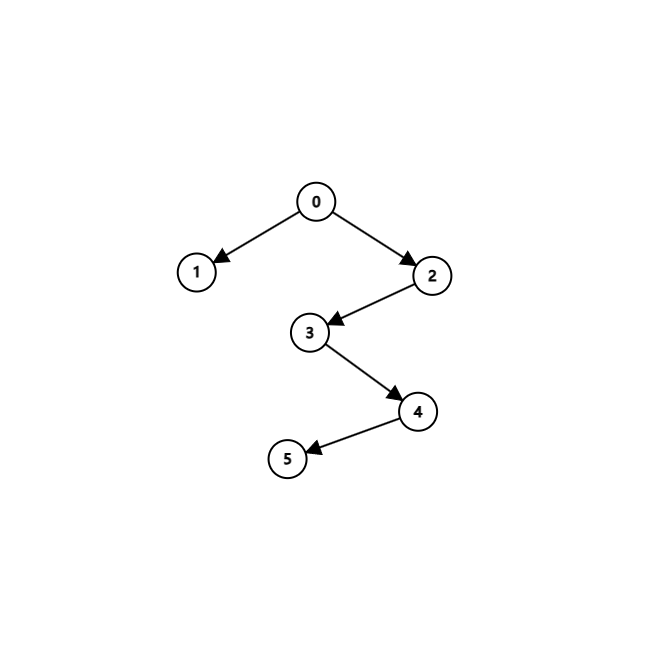

# T1

Given a path $e_1,\cdots,e_m$, the probability is $\prod_{i=1}^{m}P(e_i) = \exp(\sum_{i=1}^{m}\log P(e_i))$.

Then, finding the maximum probability path is equivalent to finding the maximum sum of $\log P(e_i)$, which is equivalent to finding the minimum sum of $-\log P(e_i)$.

Due to the fact that $P \in [0,1]$, $-\log P \in [0,+\infty)$, we may turn this problem into a shortest path problem by replacing the edge weight $-\log P(e_i)$.

Specially, we define $-\log(0)$ as $+\infty$, where $+\infty + x = +\infty$ for any $x\in\mathbb{R}^+ \cup \{0\} \cup \{+\infty\}$ and $\exp(-\infty) = 0$. Also, define $x \lt +\infty$ for any $x\in\mathbb{R}$. Then, we have a well-defined order and addition operation on $[0,+\infty]$.

Then, we can apply Dijkstra's algorithm to find the shortest path from the start to the end, with the lowest sum of $-\log P(e_i)$.

By definition, for any other path from s to t, $\sum_{i=1}^{m'}-\log P({e_i}') \ge \sum_{i=1}^{m}-\log P(e_i)$. So, $\exp(\sum_{i=1}^{m'}\log P({e_i}')) \le \exp(\sum_{i=1}^{m}\log P(e_i))$, which equals: $P({e_1}')\cdots P({e_{m'}}') \le P(e_1)\cdots P(e_m)$.

That means the path found by Dijkstra's algorithm is the maximum probability path.

# T2

## a

G is shown as follows:

In G', there is no cycle, so the graph cannot be strongly connected.

## b

If the statement doesn't hold, then there exist an edge in $G$ , removing which $G$ will not be connected, and we call it $e_1 = (u_1,v_1)$, and $G'$ is strongly connected simultaneously.

By definition, after removing $e$, $G$ will be divided into two connected components (because at first, $G$ is connected), $V_1$ and $V_2$. 

That's because if there exist an undirected edge $e = (u,v), u\in V_1, v\in V_2, e_1 \ne e$, after removing edge $e_1$, $V_1$ and $V_2$ will still be connected by the edge $e$ , which means $G - \{e_1\}$ is still connected, which contradicts the assumption.

So, we may conclude that there's no edge in $G$ (as well as $G'$) that connects $V_1$ and $V_2$ except $e_1$.

By definition, in $G'$, $e$ may have $2$ directions:

- $(u_1,v_1)$: In this case, $u_1\in V_1, v_1\in V_2$. Then we claim that $v_1$ cannot reach $u_1$ in $G'$, because if it can, then there must be a path from $V_2$ to $V_1$ in $G'$. However, there's no edge in $G$ which connects $V_1$ and $V_2$ except $e_1$, and $e_1$ has been oriented from $V_1$ to $V_2$. So, $v_1$ cannot reach $u_1$ in $G'$.
- $(v_1,u_1)$: Similar to the above case, $u_1$ cannot reach $v_1$ in $G'$.

In short, there always exist $x,y \in G'$ , with the fact that $x$ can never reach $y$ in $G'$, which means $G'$ is not strongly connected.

This contradicts the assumption that $G'$ is strongly connected. So, the statement must holds by law of contradiction.

## c

If $G$ satisfies the property that removing any single edge from
$G$ will still give a connected graph, then we will prove that $G'$ is strongly connected, which means $\forall u,v\in V, u\ne v, \exists$ path from $u$ to $v$.

Let $V$ be the set of vertices in $G$.

Consider the relationship between $u$ and $v$ in $G'$.

### case 1: u is the ancestor of v

$u$ is the ancestor of $v$: Then there must exist a path from $u$ to $v$ in $G'$ by walking on tree-edges on dfs tree.

### case 2: v is the ancestor of u

$v$ is the ancestor of $u$: Let $w$ be the parent of $u$ in the dfs tree. By the fact that assumption that "removing $\cdots$", we may remove the edge $(w,v)$, and $G$ will still be connected. Then, there must exist a path from $v$ to $w$ in $G'$.

Consider the dfs sub-tree of $v$ (all the nodes which has $v$ as one of its ancestors, and $v$ iteself; we call it $V_1$). 

Trivially, $w \notin V_1$, so there must exist a path from $x \in V_1$ to $y \in V - V_1$ other than $(w,v)$. Then, consider the edge $(x,y)$.

- $(y,x)$ is a tree edge: $y$ is the parent of $x$. Since $x\in V_1$, $V_1$ is the dfs sub-tree of $w$, so $y \in V_1 \cup \{w\}$. Along with the fact that $y \in V - V_i$, we have $y = w, x = v$, which contradicts the assumption that $x$ and $y$ are different.Unfortunately, this edge is not $(w,v)$ due to our assumption.
- $(y,x)$ is a back edge: $x$ is ancestor of $y$. Since $x\in V_1$, $V_1$ is the dfs sub-tree of $w$, so $y \in V_1$. However, $y \in V - V_1$. So this never happens.
- $(x,y)$ is a tree edge: $x$ is the parent of $y$. Since $x\in V_1$, $V_1$ is the dfs sub-tree of $w$, so $y \in V_1$, which contradicts the fact that $y \in V - V_1$.

The only case left is that $(x,y)$ is a back edge, which means $y$ is the ancestor of $x$. In addition, $x\in V_1, y\in V - V_1$ , and $V_1$ is the dfs sub-tree of $v$. So, $y$ must also be ancestor of $v$. Since from the ancestor to the descendant, there must be a directed path on dfs tree, we have a path from $v$ to $x$ (on tree), $x$ to $y$ (back edge), and $y$ to $w$ (on tree). So, there must be a path from $v$ to $w$ in $G'$.

We may conclude that for every $(w,v)$ where $w$ is the parent of $v$ in the dfs tree, there must be a path from $v$ to $w$ in $G'$.

Connection all those paths, we may get a path from $v$ to its parent, to its parent's parent, and so on, until we reach the root of the dfs tree. We will surely reach $u$, the ancestor of $v$ somewhere on the path, since $u$ is the ancestor of $v$. So, there must be a path from $v$ to $u$ in $G'$.

### case 3: no ancestor-descendant relationship

That doesn't matter. In case 2, we find a general way to find a directed path from $v$ its parent, to its parent's parent, and so on, until we reach the root of the dfs tree.

So, for any $u,v$, we may first find a directed path from $u$ to the root, and then go down the dfs-tree to $v$. So, there must be a path from $u$ to $v$ in $G'$.

## d

We define dfs-subtree of $u$: All vertices with $u$ as it ancestor, and $u$ itself.

We propose Tarjan algorithm to find all edges in a given undirected graph such that removing any one of them will make the graph no longer connected.

The algorithm work as below:

1. Run DFS on the graph, and record the dfs number (the number that calls the dfs function; we call it dfn) of each vertex.
2. In second DFS, we record the smallest dfn (we call it low) that can be reached from the current vertex's dfs subtree within one back-edge. It is initialized as dfn, and gets updated when we are visiting a vertex $v$ from $u$:
   - If $v$ is the parent of $u$, we do not perform any update.
   - Else if $v$ is the descendant of $u$, we first dfs into $v$, and then update $low[u] = \min(low[u], low[v])$.
   - Otherwise, $v$ is the ancestor of $u$, we update $low[u] = \min(low[u], dfn[v])$.
3. Checking for each edge $(u,v)$. If $dfn[u] \lt low[v]$ or $dfn[v] \lt low[u]$, then $(u,v)$ is an edge that satisfies the property.

### Correctness

First, we prove that algorithm can really find the smallest dfn that can be reached from the current vertex's dfs subtree within one back-edge.

Suppose the dfs subtree of $u$ is $V_u$. We prove it by induction on the height of $V_u$.

#### Height = 0

When the height of $V_u$ (maximum number of tree-edges to travel from $u$ to any vertex in $V_u$) is $0$, the statement is trivially true.

That's because in this time, $V_u$ has $u$ as the only vertex, so all the vertices in $V_u$ can be reached from $u$ within one back-edge is all the nodes that $u$ can reach within one back-edge and $u$ itself.

In our algorithm, all those nodes $v$ are descendants of $u$, so we will take a min of those nodes' dfn (including $u$'s dfn, since $low[u]$ is initialized as $dfn[u]$) as the $low[u]$. So, at this time, the statement that $low[u]$ is the smallest dfn that can be reached from the current vertex's dfs subtree within one back-edge, holds true.

#### Height = k + 1

If the statement holds true when the height of $V_u$ is below $k$, then we prove that it also holds true when the height of $V_u$ is $k$. Then, for all the back-edges from $u$, we will take the min of the smallest dfn that can be reached from those.

For those nodes $v$ that are descendants of $u$, by induction hypothesis, we have find out the correct $low[v]$ for them. So, we will take the min of those $low[v]$ as the $low[u]$.

So, in our algorithm, the meaning of $low[u]$ is the minimum(which is the smallest) dfn that can be reached from $u$, or its descendants. So, the statement holds true for height $k+1$.

#### Conclusion

For all the vertices $u$, the $low[u]$ is the smallest dfn that can be reached from the current vertex's dfs subtree within one back-edge.

#### Completeness

In (b), we have proved that if removing $e = (u,v)$ ($u$ is ancestor) from $G$ will make $G$ disconnected, there doesn't exist path from $v$ to vertices that are not in its dfs sub-tree.

Consequently, there doesn't exist an ancestor of $v$ which can be reached from $v$ or its dfs sub-tree within one back-edge, so the largest dfn that can be reached from $v$ or its dfs sub-tree within one back-edge is $dfn[v]$. 

As $u$ is the ancestor of $v$, $dfn[u] \lt dfn[v] \le low[v]$.

This shows that if removing $e = (u,v)$ ($u$ is ancestor) from $G$ will make $G$ disconnected, then $dfn[u] \lt low[v]$. So our algorithm can find all the edges that satisfy the property.

Next, we're going to prove that the algorithm will not find wrong edges.

#### Soundness

In (c), we have proved that if removing $e = (u,v)$ ($u$ is ancestor) from $G$ will **NOT** make $G$ disconnected, then $v$ can reach its parent (which is $u$) in $G'$.

This means that the back-edge from $v$ and its dfs sub-tree can reach $u$ or its ancestor. So, $low[v]$ should be no less than $dfn[u]$. So, $dfn[u] \lt low[v]$ will not hold.

This show that if $dfn[u] \lt low[v]$, then removing $e = (u,v)$ ($u$ is ancestor) from $G$ will make $G$ disconnected.

#### Final Conclusion

The algorithm can find all the edges that satisfy the property, and will not find wrong edges.

### Time Complexity

This algorithm runs just like normal dfs, just including some extra operations. 

We have proved in class that the complexity of dfs is $\mathcal{O}(V+E)$.

The $low$ array is updated at most once for each vertex, which is $\mathcal{O}(V)$. The update operation happens on each edge at most twice, so the time complexity is $\mathcal{O}(E)$.

The checking of $dfn$ and $low$ for each edge $(u,v)$ is $\mathcal{O}(E)$.

So, the total time complexity is $\mathcal{O}(V+E)$.

# T3

## a

$\max(|H(G)| , |T(G)|)$. First, if $|H(G)| \ne 0$, then there exists a point which can never be reaches by others. So is the case $|T(G)| \ne 0$.

Unfortunately, when adding a new edge, we can only eliminate at most one point from $H(G)$ or $T(G)$, so at least we need $\max(|H(G)| , |T(G)|)$ edges to clear all the points in $H(G)$ or $T(G)$.

So, the lower bound is $\max(|H(G)| , |T(G)|)$.

Then we will prove it is achievable (tight).

If $|T(G)| = 0$, then starting from any vertix $u$, we choose any one of the vertices $v$ that has edge $(u,v)$ . If $v$ has been visited, then the DAG has a cycle, which is impossible.

So, $|T(G)| \ne 0$. Reverse the graph, and we can also prove that $|H(G)| \ne 0$.

Note that starting from any vertix $u$, since there's no cycle, we can walk along the edges until we reach a point that cannot reach others, which is in $T(G)$.

So, we may easily conclude that for any vertex $u$, we can arrive at a point in $T(G)$. Reverse the graph, and we can conclude that for any vertex $v$, we can be reached from a point in $H(G)$.

So, as long as $H(G)$ and $T(G)$ is strongly-connected, then we can always find a path from any vertex to any other vertex, which means the graph is strongly-connected.

Without a loss of generality, we may assume that $m = |H(G)| \ge |T(G)| = n$.

We denote the vertices in $H(G)$ as $h_1,\cdots,h_m$, and the vertices in $T(G)$ as $t_1,\cdots,t_n$.

Then, we connect $t_i$ to $h_i$ for $i = 1,\cdots,n$, and connect $t_n$ to $h_i$ for $i = n+1,\cdots,m$.

Since the graph is fully reachable, we for any $h_i,h_j$, we may travel from $h_i$ to $t_{\min(j,n)} $, and then travel to $h_j$. So any $h_i$ can reach each other.

Similarly, $t_i$ can reach $t_j$, by first travelling from $t_i$ to $h_i$, and then travelling to $t_j$.

Finally, for $t_i$ and $h_j$, we may travel from $t_i$ to $h_i$, and then travel to $h_j$.

So, $H(G)$ and $T(G)$ is strongly-connected now, and consequently, the graph is strongly-connected.

In conclusion, the upper bound is $\max(|H(G)| , |T(G)|)$.

## b

By definition, there exist $h \in H(G), t \in T(G)$, such that there's no path from $h$ to $t$.

Then, we may add an edge $(t,h)$ to the graph. If a new cycle is generated, then it must contain the edge $(t,h)$, which means there's a path from $h$ to $t$. But this contradicts the assumption. So, no new cycle is generated, and the graph is still a DAG.

In addition, we may trivially find that $H'(G) = H(G) - \{h\}$ and $T'(G) = T(G) - \{t\}$. So $|H'(G)| = |H(G)| - 1$ and $|T'(G)| = |T(G)| - 1$.

## c

Here comes our algorithms:

Scanning all edges, update the in-degree and out-degree of each vertex. Then count all vertices with in-degree $0$ and out-degree $0$, and we get $|H(G)|$ and $|T(G)|$.

Return $\max(|H(G)|, |T(G)|)$.

### Correctness

According to the conclusion in (b), when the graph is not fully reachable, we may repeat the operation in (b) until the graph is fully reachable.

However, we need to prove that the graph will eventually become fully reachable.

Note that when $|T(G)| = 1$, starting from any vertix, walking along the edges, since there's no cycle, we will eventually reach the only point in $T(G)$. So, at this time, the graph is fully reachable.

Similarly, when $|H(G)| = 1$, the graph is fully reachable.

So, when we repeat the operation in (b), in the worst case, $|T(G)| = 1$ or $|H(G)| = 1$, the graph will be fully reachable naturally. That means the graph will eventually become fully reachable.

Suppose it need $k$ operations to make the graph fully reachable. Then $|H'(G)| = |H(G)| - k$ and $|T'(G)| = |T(G)| - k$. The minimum number of edges we need to add is $\max(|H'(G)|, |T'(G)|) = \max(|H(G)| - k, |T(G)| - k) = \max(|H(G)|, |T(G)|) - k$.

So in all, we add $\max(|H(G)|, |T(G)|) - k + k = \max(|H(G)|, |T(G)|)$ edges.

Since the proof in (a) that $\max(|H(G)|, |T(G)|)$ is the lower bound doesn't require the graph to be fully reachable, so it still holds true in this case.

So the minimum number of edges we need to add is $\max(|H(G)|, |T(G)|)$.

### Time Complexity

The time complexity involves scanning all edges and vertices in linear time, so the overall time complexity is $\mathcal{O}(V+E)$.

## d

Using the algorithm kosaraju in class, we may find all strongly connected components (SCC) in the graph.

We will then compress those vertices in the same SCC into one super vertex, erasing in-SCC edges, and replace across-SCC edges with a new edge (also remove all duplicates).

The new graph is a DAG, since there's no more SCC in the graph.

Then we may apply the algorithm in (c) to find the minimum number of edges we need to add to make the graph fully reachable.

### Correctness

We just need to prove that the algorithm in (c) still gives the correct answer.

First, if the graph is strongly connected after compression and adding new edges between super vertixs, then, adding those new edges only is enough to make the graph fully reachable. (Specially, an edge $(scc[i],scc[j])$ should be transformed into an arbitary edge $(x,y)$, where $x \in scc[i], y \in scc[j]$) 

This is true because if any 2 SCCs are reachable, then any of the vertices in the 2 SCCs are reachable, and consequently, the graph is fully reachable.

This shows that our algorithm's correctness is guaranteed.

Next, we will show that if the graph is strongly connected after adding new edges, then the super graph after compression and adding new edges between super vertixs is also strongly connected. (Specially, an edge $(i, j)$ should be transformed into an arbitary edge $(x , y)$, where $x$ is the SCC that $i$ belongs to, and $y$ is the SCC that $j$ belongs to)

This is true because if any 2 vertices are reachable, then trivially any 2 SCCs are reachable, and consequently, the super graph is also strongly connected.

This shows that out's algorithm's bound is still tight.

### Time Complexity

The time complexity of kosaraju's algorithm is $\mathcal{O}(V+E)$.

The time complexity of the algorithm in (c) is $\mathcal{O}(V'+E')$.

In the super graph, $V' \le V$, and $E' \le E$. So, the overall time complexity is $\mathcal{O}(V+E)$.

# T4

## a

If $G$ is a tree, then the depth-first-search tree is the same as the original tree. So is the breadth-first-search tree.

If $G$ is not a tree, then the depth-first-search tree contains at least one back edge. Consider the back edge $(v,u)$ and the tree edge $(w,v)$. $u$ is the ancestor of $v$, and $w$ is the parent of $v$, and $u$ is the ancestor of $w$.

If those 2 trees are equal, in the breadth-first-search tree: after $u$ is visited, $v$ will be visited no later than $w$, so $v$ cannot be the child of $w$. 

In conclusion, in undirected graphs, the depth-first-search tree and breadth-first-search tree are equal iff the graph is a tree.

## b

This is a counterexample. This is a acyclic directed graph.

The depth-first-search tree and breadth-first-search tree can be identical.

However, the distance of vertex $1$ is $1$, while the distance of vertex $2$ is $2$. So, $2$ must is bigger than $1$ in ascending order of distance. However, in topological order, $2$ should be visited before $1$.

## c

This is a counterexample. The distance of vertex $1,2$ is $1$, while the distance of vertex $3,4$ is $2$. So the breadth-first-search tree is shown as below:

However, if you search vertex $1$ first, then vertex $2$ cannot be at the same level as vertex $1$. It must be a child of vertex $1$. So the depth-first-search tree will not be the same as the breadth-first-search tree.

If you search by vertex $2$ first, you will sadly get a tree as below:

Whatever you do, the depth-first-search tree will not be the same as the breadth-first-search tree.

So, the converse of the statement is not true either.

# T5

## a

<!-- 
Find the smallest cycle in an unweighted, undirected graph, containing certain vertex $s$
 -->

We may enumerate all vertices adjancent to $s$, and assign them with number $1,2,\cdots,n_0$, distance $1$.

Then, we start bfs from these vertices. We keep track of which number first reached the vertex and the distance from $s$ to the vertex.

When we bfs out (take the first vertex out from the queue) from a vertex which is numbered $x$, distance $y$, there are 3 cases:

- We reach $s$ or a vertex numbered $x$. Just skip this vertex.
- We reach a vertex which has not yet been visited(not numbered yet). Assign it with number $x$, distance $y$. Push it into our queue.
- We reach a vertex which has been visited. If the number is $z$, distance is $w$, then we find a shortest cycle with length $y+w+1$.

If we have visited all vertices, then we may conclude that there's no cycle containing $s$.

### Time Complexity

This algorithm is similar to bfs. First of all, all vertices will be numbered at most once, and a vertex will be visited only when numbered. So, we may conclude that each vertex will be visited at most once, which means the time complexity is $\mathcal{O}(|V|)$.

Also, consider the operation in each visit, it will take a look at all the edges of the vertex. So, the overall operation of that equals to the sum of all edges' degree, which is $2|E|$, the time complexity is $\mathcal{O}(|E|)$.

So, the overall time complexity is $\mathcal{O}(|V|+|E|)$.

### Correctness

The correcteness of shortest distance is proved in class (bfs).

#### Abililty to find a valid cycle

First, we prove that the algorithm can find a cycle containing $s$.

We denote $(a,b,c)$ as a vertex $a$ numbered $b$ and distance $c$.

Take a look at the case when we output the result on a visit from $(a,x,y)$ to $(b,z,w)$.

First, $a$ must been updated from another vertex $a'$, where $a'$ is numbered $x$, distance $y - 1$ by our algorithm, or $a$ is adjacent to $s$.

So, there exists a path from $s$ to $a$, which contains only vertices numbered $x$, and the length is $y$.

Similarly, there's path from $s$ to $b$, which contains only vertices numbered $z$, and the length is $w$.

So, consider these $2$ paths, the only shared vertex is $s$, and there is an edge between $a$ and $b$. So, there is a cycle containing $s$, whose length is $y+w+1$.

#### Abililty to find the shortest cycle

Then, we prove that the algorithm can find the shortest cycle. If the shortest cycle is $s, v_1, \cdots, v_m, s$, then we claim that the algorithm will find it.

Let $p = \lfloor \frac{m}{2} \rfloor$. 

If the algorithm ends before $p$ rounds, the cycle size found can not exceed $2(p - 1) + 1 \lt m$, which contradicts the assumption that the shortest cycle size is $m$.

So, the algorithm must be end after $p$ rounds.

If $v_1, \cdots, v_p$ are not numbered as $v_1$, suppose $g$ is the smallest that satisfy $v_g$ is numbered as $v_1$. Then, $v_{g-1}$ is numbered as $v_1$. When bfs from $v_{g-1}$ in $g$ round, since $v_g$ is not numbered as $v_{g-1}$, our algorithm find a circle! However, we have proved that our algorithm should not end before $p$ rounds. Contradiction!

So, it's easy to see that $v_1, \cdots, v_p$ must be numbered as $v_1$. Similaryly, $v_m, v_{m-1}, \cdots, v_{m-p+1}$ must be numbered as $v_m$.

If $p$ is even, then in $p$ round, we will visit $v_{p+1}$ from $v_p$ or in a reverse manner. In our algorithm, since they are different numbered, we find that cycle. And the output will be $p + p + 1 = 2p + 1 = m + 1$.

The similarly is true for $p$ is odd, where $v_{p+1}$ will be visited from $v_p$ and $v_{p+2}$ successive. And the output will be $p + p + 2 = 2p + 2 = m + 1$.

Note that $m + 1$ is the length of the shortest cycle. So, the algorithm will find the shortest cycle in $p$ round. (If the shortest cycle is not unique, then the algorithm will find just one of them and stop).

## b

IDK. Maybe [abelcat](https://github.com/abelcategory) has told me the answer, but I shouldn't copy his answer.

# T6

Timing: (Thinking + Writing)

1. : $1\text{min} + 10\text{min}$
2. : $5\text{min} + 55\text{min}$
3. : $15\text{min} + 35\text{min}$
4. : $30\text{min} + 10\text{min}$
5. : $10\text{min} + 20\text{min}$

Difficulty: $5/5$

Collabrator: Github Copilot
