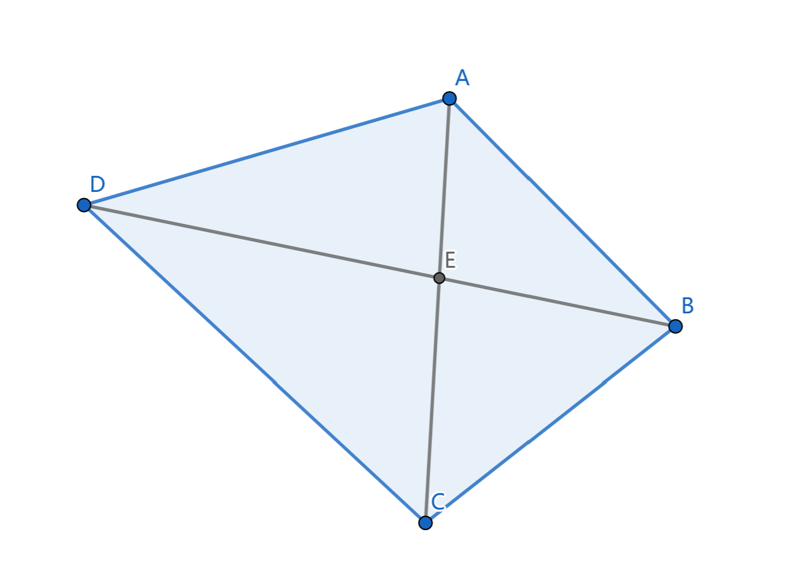

# HW4

## 1

### a

Let $f_i$ be the maximum consecutive sum of the subarray ending at $i$ (the subarray must contains the $i$-th element).

There are 3 cases:

- $f_{1} = a_{1}$
- $f_{i-1} \ge 0$: $f_i = f_{i-1} + a_{i}$
- $f_{i-1} \le 0$: $f_{i} = a_{i}$. (When equal $0$, it is the same as the second case.)

It's trivial to see that the answer we want is the maximum of $f_i$ for $i = 1, 2, \ldots, n$.

#### Correctness of $f_i$

We will prove by induction that our algorithm will correctly calculate all $f_i$.

Base case: $f_1 = a_1$ is trivial.

If the hypothesis holds for $n = k - 1$, then for $n = k$. Suppose the maximum consecutive sum of the subarray ending at $k$ starts from $j$, which is $a_{j}, a_{j+1}, \ldots, a_{k}$. Suppose the maximum consecutive sum of the subarray ending at $k-1$ starts from $i$, which is $a_{i}, a_{i+1}, \ldots, a_{k-1}$.

- $j = k$: then it must hold that $f_{k - 1} \le 0$. Otherwise, the consecutive sum from $i$ to $k$ is $a_{i} + a_{i+1} + \ldots + a_{k - 1} + a_{k} = f_{k - 1} + a_{k} > f_{k}$. This contradicts the assumption that $f_{k}$ is the maximum consecutive sum of the subarray ending at $k$, where $i$ is a better substitute for $j$.
- $j \lt k$. Then if $j \ne i$, consider the subarray $a_{i}, a_{i+1}, \cdots a_{k}$. The sum of this subarray is $f_{k - 1} + a_{k}$. Compare $LHS = f_{k - 1} + a_{k}$ with $RHS = f_{k}$.
    1. If $LHS \lt RHS$, then $a_j + a_{j+1} + \cdots + a_{k + 1} = f_k - a_k \gt f_{k - 1}$. This contradicts the assumption that $f_{k - 1}$ is the maximum consecutive sum of the subarray ending at $k - 1$. So $LHS \ge RHS$.
    2. If $LHS \gt RHS$, similarly, this contradicts the assumption that $f_k$ is the maximum consecutive sum of the subarray ending at $k$.
    3. $LHS = RHS$, which means $f_{k} = f_{k - 1} + a_{k}$. Then consider what our algorithm will output. If $f_{k - 1} \lt 0$, then trivially, $a_k$ alone is a better subarray ($j' = k$), which contradicts that $j \lt k$. So, in this case, our algorithm will goto the second case. The answer $f_{k} = f_{k - 1} + a_{k}$ is correct.

#### Our algorithm is correct

Then, we are going to prove that our algorithm will correctly calculate all $f_i$.

- If $j = k$, then $f_{k - 1} \le 0$ and $f_{k} = a_{k}$. In our algorithm, this is the third case.
- If $j \lt k$, then $f_{k} = f_{k - 1} + a_{k}$ and $f_{k - 1} \ge 0$. In our algorithm, this is the second case.

Consequently, by induction, the hypothesis holds for all $n$. Our algorithm will correctly calculate all $f_i$.

> Sorry that I forgot to find the subsequences. But I think that is not the core of this problem. Therefore, I'd just give a brief explanation here.

If we want to find the subsequences, we just need to record the first index of the maximum $f_i$.

In those 3 cases:

- first index of $1$ is $1$.
- if $f_{i-1} \ge 0$, then first index is $f_{i-1}$'s first index.
- if $f_{i-1} \le 0$, then first index is $i$.

The correctness is similar to induction above, and I will not repeat it here.

#### Time complexity

The time complexity of this algorithm is $O(n)$, since we just enumerate all $i$ from $1$ to $n$, and perform $O(1)$ operations in each iteration.

### b

We may denote a subarray satisfying the requirement as a good subarray. And we define maximum sum is the maximum sum of a good subarray.

We can use $f_{j}$ to represent the maximum sum of good array which ends at $j$. ($a_j$ must be included in the good array.)

It's trivial that the maximum $(L-R)-\text{step}$ subsequence, must end at some $z$, so the maximum subsequence must be exactly the good array ending at $z$, with the maximum sum as $f_z$, we may simply find out which one is the best by comparing all $f_i$, and the maximum one is the answer.

We will find $f_i$ as below:

- $f_i = a_i$ for $i = 1, 2, \ldots, L$
- $f_i = \max(0, \max(f_{j})) + a_i, \max(i - R,1) \le j \le i - L$

We will next prove that $f_i$ is correct. We may prove by induction.

Base case: for those $i \le L$, $f_i = a_i$ is trivially correct.

If the hypothesis holds for $n = k - 1$ and $k \gt L$. Then for $n = k$. We just need to consider the length of the maximum good subarray ending at $k$.

- The length is $1$, which means $f_k = a_k$. Then, for all $j \in [k - L, k - R]$, if $f_j \ge 0$, then we may make up the new good subarray ending at $k$ by adding $a_k$ to the good subarray ending at $j$. The sum of this new good subarray is $f_j + a_k \gt a_k = f_k$, which contradicts the assumption that $f_k$ is the maximum sum of good subarray ending at $k$. So, $f_k = a_k$ is correct. In this case, $\max(f_j) \lt 0$, so our algorithm will output $0 + a_i = a_i$ which is correct.
- The length is $l \gt 1$. Then, consider the second last element in the maximum good subarray $a_j$, due to the nature of $(L-R)-\text{step}$, we must have $j \in [k - L, k - R]$. If sum of the sequence with-out $a_k$ is less than $f_j$, then we may add $a_k$ to the sequence to get a better good subarray. This contradicts the assumption that $f_j$ is the maximum sum of good subarray ending at $j$. So, $f_k = f_j + a_k$ is correct. Since $j \in [k - L, k - R]$, we may find the maximum $f_j$ by enumerating all $j$ in $[k - L, k - R]$. So, $f_k$ is correct, and in this case, our algorithm will output $\max(f_j) + a_k = f_k$ which is correct.

By induction, the hypothesis holds for all $n$. Our algorithm will correctly calculate all $f_i$.

#### Time complexity

The time complexity of this algorithm is $O(n^2)$, since we just enumerate all $i$ from $1$ to $n$, and in each iteration, we need to find the maximum of $f_j$ in $[i - L, i - R]$, which involves at most $n$ elements.

### c

We are going to optimize the algorithm in b.

#### Lemma

First we may make an observation that for those in $[i - R, i - L]$, suppose $j,k \in [i - R, i - L]$ and $j \lt k$, if $f_j \le f_k$, then we may safely ignore $j$ during the enumeration, since for any $l \gt i$, if $f_l$ is calculated from $f_j$, then $f_k$ is always a no-worse choice (because $j,k \in [i - R, i - L]$ and $j \lt k$, $i \lt l$ and $j \in [l - R, l - L]$ means that $k \in [l - R, l - L]$, $k$ is also valid, while $f_k \ge f_j$). So, we may safely ignore $j$.

So we want to maintain a double-ended queue $Q$ to store some of the elements in $[i - R, i - L]$ in ascending order of index. Specially, $a_j \in Q$, iff $\forall k \in [j + 1, i - L], f_j \gt f_k$.

We may easily find that the $Q$ has the following properties:

1. It must contain at least one element $f_{i - L}$.
2. For some $a_j$ outside the queue, there must exists some $k$ where $j \lt k$ and $f_j \le f_k$.
3. The array is in descending value of $f$. (If non-descending, we may remove the first element.)

Due to property $2$, the maximum $f$ in $[i - R, i - L]$ is always in the queue. Due to property $1$ and $3$, the maximum element is always the first element in the queue, and it must exists in the queue.

So, if we can maintian the queue correctly, we may find the maximum $f$ in $[i - R, i - L]$ in $O(1)$ time (first element in the queue). Then, we can use the algorithm in (b) to calculate all $f_i$ in $O(n)$ time. The overall time is $O(n) + O(\text{maintain the queue})$.

#### Maintain the queue

We propose the following algorithm to maintain the queue.

- When $i \le L$, the queue is useless(we don't need to calculate $f_i$), so we just ignore it.
- When $i \ge L$, we perform these operations to maintian the queue:
    1. If the first element in the queue is out of the range $[i - R, i - L]$, then pop the first element in the queue.
    2. Compare the newly added $f_{i - L}$ with the last element in the queue. If $f_{i - L} \ge f_{\text{last element}}$, then pop the last element in the queue. If $f_{i - L} \lt f_{\text{last element}}$, or the queue is empty, then add $f_{i - L}$ to back
     the queue.

We claim that we have maintained the queue correctly.

This can be proved by induction.

For $i \le L$, the queue is useless, so we don't need to prove it.

For $i = L + 1$, we have only one element in the queue, which is $f_{L}$. The queue is correct.

If the hypothesis holds for $n = k - 1$ and $k \gt L$. Then for $n = k$. We just need to consider the newly added $f_{k - L}$, since for any $f_j \in Q$, $\forall l \in [j + 1, k - 1 - L], f_j \gt f_l$ by induction hypothesis. Since the queue is in ascending order of index, and descending order of $f$, we may pop the element from the back. After each pop operation, the queue is still in ascending order of index, and descending order of $f$. And if $f_{k - L} \lt f_{\text{last element}}$ at some time, any $f_j \in Q$ will be larger than $f_{k - L}$. Finally, we just need to add $f_{k - L}$ to the back of the queue. If the queue goes empty, the case is similar. The process above is just what we have proposed in the algorithm.

We have proved that all those in queue when $n = k - 1$ have been correctly maintained. Still, we need to prove that those out of queue when $n = k - 1$ will never be in the queue when $n = k$. If $f_j$ is out of the queue when $n = k - 1$, then there must exists some $k$ where $j \lt k$ and $f_j \le f_k$. This still holds in $n = k$. So, they will not go into the queue, and our algorithm is doing right.

Specially, we may easily observe that only the first element may newly go out of the range $[i - R, i - L]$, so we give it a check to see if the first element is out of the range.

So by induction, our algorithm is correct for all $n$.

#### Time complexity

We just need to prove that the time complexity of maintaining the queue is $O(n)$.

Consider the operations in the queue:

- The overall checking of the first element will be perform at most $n$ times.
- In each iteration, at most one element will be added to the queue. Each element can be only be pushed and poped at most once. At most $n$ elements will be pushed and poped. So, the overall time complexity of push and pop is $O(n)$.
- The count of comparation in each iteration $c_{\text{comp}}$ is at most $c_\text{pop} + 1$. So the overall comparation is $O(n) + O(\text{pop}) = O(n)$.

So, the time complexity of maintaining the queue is still linearly. Consequently, our algorithm can run in $O(n) + O(\text{maintain the queue}) = O(n)$ time.

## 2

<!-- 
Use a binary search tree as a dictionary. Each word assigned with a weight $w_i$. We want to minimum cost $\sum_{i=1}^{n} w_i \cdot d_i$, where $d_i$ is the depth of the word $w_i$ in the binary search tree.
 -->

We denote $f_{i,j}$ as the minimum cost of building a dictionary with words $w_i, w_{i+1}, \ldots, w_j$. We need to find out $f_{1,n}$.

We may easily observe that, if the root of the optimal of $f_{i,j}$ is $x$, then those in $[i, x - 1]$ is in the left subtree and those in $[x + 1, j]$ is in the right subtree. And the cost equals to $\text{cost in left subtree} + \text{sum of weight in left subtree} + \text{cost in right subtree} + \text{sum of weight in right subtree} + w_x = \sum {w_i} + \text{cost in left subtree} + \text{cost in right subtree}$. Since its optimal, the $\text{cost in left subtree}$ and $\text{cost in right subtree}$ are also optimal. So we have $f_{i,j} = (\sum_{k=i}^{j} w_k) + f_{i,x-1} + f_{x+1,j}$. By enumeration between $i$ and $j$, we may find out the optimal $f_{i,j}$.

The algorithm is as follows:

- $f_{i,j} = 0$ for $i \gt j$
- $f_{i,j} = x_i$ for $i = j$
- $f_{i,j} = (\sum_{k=i}^{j} w_k) + \min_{x \in [i,j]} (f_{i,x-1} + f_{x+1,j})$ for $i \lt j$

The correctness of the algorithm can be proved by induction on the size of $j - i$.

When $i = j$, the cost is trivially $w_i$.

When $i \lt j$, based on the observation before, the correctness based on the correctness of the subproblems. Due to the hypothesis, the subproblems are correct. So, the hypothesis holds for all $i,j$.

So, the algorithm is correct.

Still, this algorithm is not perfect enough, as we need to enumerate the size of $j - i$, and enumerate all the subranges, which requires $O(n) \times O(n ^ 2) = O(n ^ 3)$ time.

First, we may use prefix sum $S_x = \sum_{i = 1}^{x} w_i$ to calculate $\sum_{k=i}^{j} w_k$ in $O(1)$ time by $S_j - S_{i - 1}$.

To apply the quadrangle inequality, we may first tranform our definition. We define $g_{i,j} = f_{i,j - 1}$, and $s_{i,j} = S_{j - 1} - S_{i - 1}$.

Now, we may calculate $g$ as follows: (we treat the second case above as a special case of the second case below)

- $g_{i,j} = 0$ for $i \ge j$
- $g_{i,j} = s_{i,j} + \min_{x \in [i,j)} (g_{i,x} + g_{x+1,j})$ for $i \lt j$

What we need is $f_{1,n} = g_{1,n + 1}$.

For all $i,j,i',j'$, we have $s_{i,j} + s_{i',j'} = S_{j - 1} - S_{i - 1} + S_{j' - 1} - S_{i' - 1} = S_{j - 1} + S_{j' - 1} - S_{i - 1} - S_{i' - 1} = s_{i,j'} + s_{i',j}$. This means that the triangle inequality holds for $s$.

According to what is taught in class, we may apply the quadrangle inequality to optimize the calculation of $g$. This means the best position $x_{i,j}$ of $g_{i,j}$ is always in the range $[x_{i,j-1}, x_{i+1,j}]$. We may record those previous results, and enumerate by the order of $j - i$. In one iteration where $\Delta = j - i$ remains the same, the $x_{i,j}$ can only falls in the range $[x_{i,j-1}, x_{i+1,j}]$. The overall time of this iteration is $(x_{2,\Delta + 1} - x_{1,\Delta}) + \cdots + (x_{n - \Delta, n + 1} - x_{n - \Delta + 1, n}) = x_{n - \Delta, n + 1} - x_{1,\Delta} \lt n - 0 = n$. There are $O(n)$ iterations in all.

To sum up, the overall time complexity is $O(n) \times n = O(n ^ 2)$.

The correctness of quadrangle inequality is guaranteed in class.

## 3

Let $C$ be the color scheme of all the vertices ($\text{vertex} \mapsto \text{color}$) with no more than $c$ colors. We claim a coloring $C$ is valid in $V$ iff $\forall u,v \in V, (u,v) \in E \Rightarrow C(u) \ne C(v)$.

Let $f_{C,u}$ be whether there exists a coloring $C'$ satisfing that $C'(x) = C(x), \forall x \in B(u)$ and $C'$ valid in $B(T(u))$.

We may easily observe the fact that although there are many coloring for the whole vertex set $V$, yet in $f_{C,u}$, only the coloring of $B(u)$ in $C$ is important. So when we enumerate $C$ for $f_{C,u}$, we just need to enumerate all coloring $C$ in $B(a)$. There exist at most $c^{k + 1}$ such schemes, where $k$ is the number of tree-width.

### Base case (Leaves)

- $f_{C,u} = 1$ enumerate all coloring in $B(T(u)) = B(u)$ to find if there's a satisfying coloring.
- $f_{C,u} = 0$ otherwise.

### Recursion

For simplicity, we introduce those arithmetics for $f$ values:

- $f_1 \cup f_2$: logical or, $0$ iff $f_1 = 0$ and $f_2 = 0$, $1$ otherwise.
- $f_1 \cap f_2$: logical and, $1$ iff $f_1 = 1$ and $f_2 = 1$, $0$ otherwise.

For a non-leaf vertex $u$ and $C$, we first check if $C$ is valid in $B(u)$. If not, then of course $f_{C,u} = 0$. Then, we may enumerate all children $a$ of $u$. For each child $a$, we enumerate all coloring $C''$ in $B(a)$, checking the constraint that $C''(x) = C(x), \forall x \in B(a) \cap B(u)$ and $f_{C'',a} = 1$. If there's no such $C'$, we denote $g_{C,u,a} = 0$, otherwise $g_{C,u,a} = 1$.

Then, we claim: $$f_{C,u} = \bigcap_{a \in \text{children}(u)} g_{C,u,a}$$

### Last step

In the end, we just enumerate all $C$ in $B(root)$. If some $f_{C,root} = 1$, we output $1$, otherwise $0$.

### Correctness

- Base case is trivial.
- For recursion part, an arbitrary $f(C,u)$, if $C'$ is valid in $B(T(u))$, then $C'$ must be separately valid in all $B(T(a)), a \in \text{children}(u)$, and of course, in $B(u)$. Note that due to the nature of tree decomposition, for any $a,b \in \text{children}(u), a \ne b$, $(B(T(a)) - B(u)) \cap (B(T(b)) - B(u)) = \emptyset$, and there's no edges between bags. So, those child tree coloring will not interfere with each other (this happen only if there's bridge across bags, or share common vertices, which has been impossible). The only possible interference is that the common part of the child tree and the parent: those shared vertices and edges. Since the edges are within the bags, those shared edges must appear in $B(u)$, so we check first whether $C$ is valid in $B(u)$. Also, those shared vertices must be colored the same in child tree plans and the parent tree plan. So, we just need to check whether $C''$ is valid in $B(a)$, where $C''(x) = C(x), \forall x \in B(a) \cap B(u)$. In addition, there should be at least a plan which is valid for each child tree, so we introduce $g$, which is $1$ if there's a valid plan for the child tree. Finally, we must consider all the child trees. Only when each child tree has a valid plan, and the valid plan do not conflict of current $C$, we may have a valid plan for the whole tree. That's why we cap all $g_{C,u,a}$.
- In the end, we just enumerate all $C$ in $B(root)$. If some of them are valid, that means there's a valid plan for the whole tree, so we output $1$, otherwise $0$.

### Timing

For each vertice, we will enumerate all children, which is at most $n$. Also, we enumerate all coloring in $B(u)$ and $B(a)$, each of which is at most $c^{k + 1}$. We enumerate all vertices, which is at most $n$. Checking for conflict requires at most $|B(u)| \times |B(a)| = O(k^2)$ time.

So, the overall time complexity is $O(c^{2(k + 1)} \times k^2 \times n^2)$. Pretty good.

## 4

### a

First of all, it's clear that $d^{(r)}(i,j) \ge \max \{ d^{(s)}(i,k), d^{(t)}(k,j)\}$. Because for the maximum $k$, we may simply join the longest path from $i$ to $k$ and $k$ to $j$, the new route using $s + t = r$ edges. Since $d^{(r)}(i,j)$ is the maximum, LHS must be no less than RHS.

Then consider the path of the maximum of $d^{(r)}(i,j)$: $i = x_0 \to x_1 \to x_2 \to \dots x_{r-1} \to x_r = j$. Consider $x_{s} = v_a$. If $a \lt i$, then there must exist at least one edge $v_m = x_l \to x_{l+1} = v_n$ where $m \gt n$, which indicates $d(x_l, x_{l+1}) = -\infty$. So, $d^{(r)}(i,j) = -\infty \le \max \{ d^{(s)}(i,k), d^{(t)}(k,j)\}$.

The case is similar when $a \gt j$. In both cases, we have $d^{(r)}(i,j) = -\infty \le \max \{ d^{(s)}(i,k), d^{(t)}(k,j)\}$.

If $a \in [i,j]$, we may divide the path into $2$ parts:

- $i = x_0 \to x_1 \to \dots \to x_{s-1} \to x_s = v_a$, which should be no greater than $d^{(s)}(i,a)$ due to the definition of $d^{(s)}(i,a)$.
- $v_a = x_s \to x_{s+1} \to \dots \to x_{r-1} \to x_r = j$, which should be no greater than $d^{(r - s = t)}(a,j)$ for the same reason.

In this case $\max \{ d^{(s)}(i,k), d^{(t)}(k,j)\} \ge d^{(s)(i,a)} + d^{(t)}(a,j) \ge d^{(r)}(i,j)$.

So, we may draw the conclusion that LHS is no greater than RHS, and LHS is no less than RHS. This means that $d^{(r)}(i,j) = \max \{ d^{(s)}(i,k), d^{(t)}(k,j)\}$.

### b

Due to what is learnt in Combinatorics last semester, for a convex polygen, any $4$ points can make up a new convex $4$-gon.

So, we just need to proves that for an convex $ABCD$:

$$
AC + BD \ge AB + CD
$$

Since $ABCD$ is convex, we may suppose that $AC$ and $BD$ join at $E$ inside the polygon. Then, we may have:

$$AC + BD = AE + EC + BE + ED = (AE + BE) + (CE + ED) \ge AB + CD$$

> The last step is due to the triangle inequality.

### c

We may prove by induction.

For $r = 1$, it's the case since $d^{(1)}(i,j) = d(i,j)$.

If it holds for $r - 1$, then for $r$, we denote $d^{(r-1)}(i,j) = g(i,j)$, which satisfies inverse quadrangle inequality. Then, we have:

$$
s \in [i',j], t \in [i,j'], \text{RHS} = \max \{d(i',s) + g(s,j) + d(i,t) + g(t,j)\}
$$

Without a loss of generality, we may suppose that $s \le t$. Then, we may have:

$$
\begin{aligned}
d(i',s) + g(s,j) + d(i,t) + g(t,j)
&   = d(i', s) + d(i, t) + g(s, j) + g(t, j') \\
& \le d(i', t) + d(i, s) + g(s, j') + g(t, j) \\
&   = d(i', t) + g(t, j') + d(i, s) + g(s, j) \\
& \le d^{(r)}(i', j') + d^{(r)}(i, j) \\
\end{aligned}
$$

The first less equal is due to the inverse quadrangle inequality of $d$ and $g$ (induction hypothesis). The second less equal is due to the definition of $d^{(r)}$ (maximum).

Consequently, we may draw that maximum of $d(i',s) + g(s,j) + d(i,t) + g(t,j)$ (which is RHS) is no greater than $d^{(r)}(i', j') + d^{(r)}(i, j)$ (which is LHS).

Then, we may prove that LHS is no less than RHS.

### d

> Hack: If the $s,t$ is variable, just consider $k = j, s = r, t = 0$ , a dummy solution... So $j \le j + 1 \le j + 1$.

We denote $d^{(s)}(i,j)$ as $f(i,j)$, and $d^{(t)}(i,j)$ as $g(i,j)$.

If the hypothesis doesn't hold for $i,j$. Let $K(i,j) = a \gt b = K(i,j+1)$.

By definition of $K$, we have:

$$
f(i, b) + g(b, j + 1) \gt f(i, a) + g(a, j + 1) \\
i \le b \lt a \le j
$$

Since $f$ and $g$ satisfy the inverse quadrangle inequality, we have:

$$
\begin{aligned}
& g(b, j) + g(a, j + 1) \ge g(b, j + 1) + g(a, j) \\
\Leftrightarrow ~\
& g(b, j) - g(b, j + 1) \ge g(a, j) - g(a, j + 1) \\
\end{aligned}
$$

Consequently, we have:

$$
\begin{aligned}
f(i,b) + g(b, j + 1) + (g(b, j) - g(b, j + 1))
& \gt f(i, a) + g(a, j + 1) + (g(a, j) - g(a, j + 1)) \\
\Leftrightarrow ~\
f(i,b) + g(b, j)
& \gt f(i, a) + g(a, j) \\
\end{aligned}
$$

This contradicts the assumption that $a = K(i,j)$ (which indicates $f(i,b) + g(b, j) \le f(i, a) + g(a, j)$).

So, we may draw from contradiction that $b \ge a$, which means $K(i, j + 1) \ge K(i, j)$. Similarly, $K(i, j + 1) \le K(i + 1, j + 1)$. That is:

$$
K(i, j) \le K(i, j + 1) \le K(i + 1, j)
$$

### e

This quesition is fairly easy.

#### Part 1

First, if we have $d^{(s)}(i,j)$ and $d^{(t)}(i,j)$ pre-calculated, then we claim that we can solve $d^{(r)}(i,j)$ in $O(n^2)$ time, where $r = s + t$

In (a), we have proved that $d^{r}(i,j)$ can be calculated by enumerate all $k$ in $[i,j]$ and find the max of $d^{(s)}(i,k) + d^{(t)}(k,j)$. This $k$ is what is defined as $K(i,j)$ in (d). Based on the fact that $K(i,j) \le K(i, j + 1) \le K(i + 1, j + 1)$, we may optimize the process just as the Quadrangle Inequality proved in class.

We enumerate the length of the interval $len = j - i + 1$ from $1$ to $n$. In each iteration, we enumerate all $i,j$ satisfing $1 \le i,j \le n, i + len - 1 = j$. When calculating, we keep track of where the maximum is reached (which is $K(i,j)$). For a specific $i,j$, we just need to enumerate to find the maximum in the range $K(i, j - 1)$ to $K(i + 1, j)$. Note that we enumerate by $len$ first, and in $K(i, j - 1), K(i + 1,j)$, the length is $j - 1 - i + 1 = j - i = len - i$, which means these $K$ have been calculated in the previous iteration. In the end, we may find all $d^{(r)}(i,j)$.

Its correctness is guaranteed by the proof in (a) and (d).

In each iteration, we enumerate $K(1, len) \to K(2,len + 1) \to \dots \to K(n - len + 1, n)$. The overall traversal time in one iteration is at most $K(n - len + 1,n) - K(1,len) \le n - 0$. There are at most $n$ iterations. So, the overall time complexity is $O(n^2)$.

#### Part 2

We have proved that if $d^{(s)}(i,j)$ and $d^{(t)}(i,j)$ are pre-calculated, then we may solve $d^{(r)}(i,j)$ in $O(n^2)$ time. At the beginning we may easily calculate $d^{(1)}(i,j) = d(i,j)$ by using brute force, enumerating each pair of vertices, which is $O(n^2)$ time.

Then, we can have a trick below: we split the number $r$ to its binary representation in at most $log^(r)$ bits:

$$
r = \sum_{i=0}^{log(r)} 2^i \cdot b_i, b_i \in \{0, 1\}
$$

First of all, since $2^{i} = 2^{i-1} + 2^{i-1}$, we can calculate out all these $d^{(2^i)}$ using the result of $d^{(2^{i-1})}$ and $d^{(1)}$.

> Remark: This should be proved by induction, but I think this is too trivial...

Then, we may maintain a number $p$, and enumerate these bits. If $b_i = 1$, then we calculate $d^{(p)}$ using $d^{(p - 2^i)}$ and $d^{(2^i)}$ and set $p = p + 2^i$.

In the end, we have $p = r$ and $d^{(r)}$ is calculated. This involves at most $\log(r) + 1$ iteration in finding the $d^{(2^i)}$ and at most $\log(r)$ iteration in maintaining $p$ calculating $d^{(p)}$. So, there are in all no than $O(\log r)$ iterations, each of which run in $O(n^2)$ time. Consequently, the overall time complexity is $O(n^2 \log r)$.

> Remark: This should be proved by induction too, but still trivial.

## 5

> Me: It's too hard to prove some of those algorithms in detail. Sometimes it's hard to balance between simplicity and correctness.

Time distribution (thinking of ideas + writing with detailing):

- T1: $1 \text{min} + 59\text{min} = 60\text{min}$
- T2: $10 \text{min} + 40\text{min} = 50\text{min}$
- T3: $30 \text{min} + 50\text{min} = 80\text{min}$
- T4: $30 \text{min} + 90\text{min} = 120\text{min}$

Difficulty: $4 / 5$
