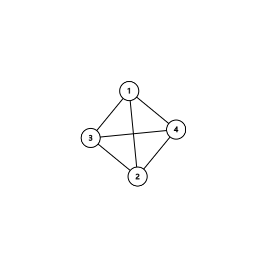

# HW5

$$
\newcommand{\from}{\leftarrow}
\newcommand{\O}{\mathcal{O}}
$$

## T1

This problem is easy. If there exists a cycle (we do not care the direction of the edge on the cycle), in the network, assume it is $X_1X_2\cdots X_t=X_1$. The direction of the edge in the cycle is arbitrary (e.g. either $X_1 \to X_2$ or $X_2 \to X_1$ is ok). Since the length of the cycle is at least $3$, we may find a direction (either $X_1X_2\cdots X_t=X_1$ or $X_1=X_t\cdots X_2X_1$ direction) that there is at least one edge in the cycle that follows this direction. We take out all the edges following such direction, and take the minimum capacity of them all, denoted as $w$. Then for all the edges on the cycle, if its direction is the same as chosen direction, we decrease the capacity by $w$. Otherwise, we increase the capacity by $w$. This operation equals to the fact that everyone in the cycle given the next one with $w$ and receive $w$ from the previous one.

(For example, consider $X_1 \to_4 X_2 \from_2 X_3 \to_1 X_1$. We may chose the direction $X_1X_2X_3X_1$, then the $w$ is $1$, so we will transform the graph into $X_1 \to_3 X_2 \from_3 X_3$ , which is equivalent. )

After this operation, we transform the network into an equivalent, which will eliminate at least one edge's capacity in the cycle. Note that all these operations will not introduce new edges (which will not violate the principle), and will eliminate any undirected cycle in the cycle.

So, given the initial graph, we may eliminate all the undirected cycles from the graph. Since there's at most $|V|^2$ edges in the graph, each time we will eliminate at least $1$ edge from $1$ cycle, in the end this graph will become an acyclic (in the sense of undirected graph), which means there's at most $n - 1$ edges.

## T2

### 2.a

For each $i \in U$, we create a virtual node $x_i$ . For each $A_j \in \mathcal{A}$, similarly, we create a virtual node $y_i$. An edge $(x_i,y_j)$ if and only if $i \in A_j$.

In addition, we add a virtual source node $s$ and terminal node $t$, where $s$ connects each $x_i$, and $t$ connects each $y_j$. We assign each edge with capacity of $1$.

Then, we claim that the primal problem exists a solution if and only if this network flow's maximal flow equals to $k$.

$\Rightarrow$  If there exists a representative $a_1,\cdots,a_k$, then there exists  $k$ flows from $s \rightarrow x_{a_i} \rightarrow y_i \rightarrow t $ . Since the maximal flow is restricted by $t$ (contains at most $k$ sources), the maximal flow is exactly $k$.

$\Leftarrow$ Similarly, if the maximal flow is exactly $k$, due to the nature of our graph, a flow must be like this $s \rightarrow x_i \rightarrow y_j \rightarrow t$ . What's more, since each $x_i$ has exactly one in-edge and $y_j$ has exactly one out-edge, so assume those $k$ flows are $s \rightarrow x_{c_i} \rightarrow y_{d_i} \rightarrow t$. Then there exists no $i,j, i\ne j, c_i = c_j \bigvee d_i = d_j$ , otherwise some node might have more than one in/out-flow-edge, which impossible. However, there is exactly $k$ nodes $y$-typed. So, we may rearrange these flows to $s \rightarrow x_{a_i} \rightarrow y_i \rightarrow t$. If we choose $a_i$ as the representative of $A_i$, then it's easy to check that it's a valid solution by our network's definition.

So, we successfully transform the primal problem into a bipartite graph maximal flow problem, where the capacity of each edge is exactly $1$​.

We have prove in class, $\text{Dinic}$ algorithm runs in $\mathcal{O}(E\sqrt{V})$  time, where $E \le nk + n + k$, and $V \le n + k + 2$. So, we have the time complexity $\mathcal{O}(nk\sqrt{n + k})$.

### 2.b

This problem is similar to 2.a.

We just add virtual node $x_i,y_j$ to each $A_i, B_j$. We add two additional intermediate layer of $z_i,w_i$ corresponding to each $i \in [n]$. Then we connects $s$ to all $x_i$, $x_i$ to $z_j$ if and only if $j \in A_i$, $z_j$ to $w_j$ , $w_j$ to $y_i$ if and only if $j \in B_i$ , and all $y_i$ to $t$.

Similar to the proof in 2.a, we may easily prove that primal problem exists a solution if and only if this network flow's maximal flow equals to $k$, since for different flow $s \rightarrow x_i \rightarrow z_j \rightarrow w_j \rightarrow y_l \rightarrow t$ , since for each non $s,t$ node, either its in/out edge capacity is $1$, so each node can appear at most once in the overall flow (otherwise, some node may be "overflowed"). Similar to the proof in 2.a,  we may derive that the solution where the representative where $a_i = j$, $b_l = j$ valid since all those flow are disjoint(a.k.a, each node can appear at most once in the overall flow). Also, if there's a valid representation where $a_i = j = b_l$, we may build such a network as above.

So, the correctness is guaranteed. Proof similar to 2.a. (keen observation: each node can appear no more than once in a valid flow).

As proved in class, $\text{Dinic}$ in this case has worst time complexity $\mathcal{O}(EV^2)$ where $E \le n + 2k + 2nk$ and $V \le 2n + 2k + 2$. So, the time complexity is $\mathcal{O}((n + k)^2nk)$

However, using the conclusion in T3, we may have $\mathcal{O}(EV^{\frac 2 3}) = \mathcal{O}(nk(n + k)^{\frac 2 3})$ or $\O(E^{\frac 3 2}) = \O(n^{1.5}k^{1.5})$.

## T3

### 3.a

We divide the proof into $2$ parts, just as the proof of $\text{Dinic}$ .First, we prove that finding a block requires $\mathcal{O}(E)$ times. Then, we prove that there is at most $\mathcal{O}(\sqrt{E})$ round.

First of all, consider the process of finding a block. Each time we find a valid flow, since the weight of the edge is exactly $1$, we will remove all the edges along the path. If in $\text{dfs}$ we fail to find a valid edge, we may delete all the edge on the path. Whatever the case, each edge in the graph will be visited at most once, so finding a block requires just at most $\O(E)$ time.

The property of the weight of the edge is exactly $1$ can be guaranteed by the fact that all the capacity is initialized to $1$, and when we find a flow, since all the edge on it has capacity $1$, when we reverse it before the next round, the capacity of newly added edge in the next round is still $1$. So, the capacity of any edge is $1$ at any iteration.

Then, we will prove that there is at most $\O(\sqrt{E})$ round.

In class, we have proved that $\text{dist}(s,t) \ge \sqrt{E}$ in $G^\mathcal{F}$ after $\sqrt{E}$ rounds in $\text{Dinic}$. In this case, there should be at least $\sqrt{E}$ levels between start and end. Since there's no more than $E$ edges, the average of inter-level edges is $\sqrt{E}$, which means there should be $2$ levels, where the edge count between these $2$ levels are no more than $\sqrt{E}$. This indicate that there's at most $\sqrt{E}$ flows remained (the bottom neck is edges between these $2$ layer). In each round, we will eliminate at least $1$ flow. So we just need an extra of no more than $\sqrt{E}$ to find all the rest flows. So, in $2 \sqrt{E}$ rounds, we can finish all the iteration. That's $\O{(\sqrt{E})}$ time.

So in all, we finish in $\O(E \sqrt{E}) = \O (E^{3/2})$ time

### 3.b

The proof is similar to 3.a. We have proved that finding a block requires no more than $\O(E)$ time. We just need to indicate that the iteration can finish in no more than $\O(V^{2/3})$ iterations.

Since now  $\text{dist}(s,t) \ge 2V^{2/3}$ in $G^\mathcal{F}$ after $2V^{2/3}$ rounds in $\text{Dinic}$. So, the average sum of $|D_i \cup D_{i + 1}|$ is no more than:  $\dfrac{2 V}{2 V^{2 / 3}} = V^{1/3}$ , which implies that there should exists $|D_i \cup D_{i + 1}| \le V^{1/3} $ . Then we may find that there's strictly less than $V^{1/3} \times V ^{1/3} = V ^{2/3}$ edges between these $2$ levels. As the proof in 3.a, we can claim that the bottom neck is these $2$ layers, and within another $V^{2/3}$ rounds. So in all, our algorithm finish $3 V ^ {2/3}$ rounds.

To sum up, the time complexity is $\O(E V^{2/3})$

## T4

### 4.a

$x_e = 0$ means that an edge $e$ is not chosen, while $x_e =1$ means chosen. $\sum{x_e}\le1$ means that for each vertex, it should be covered by exactly one edge. When $x_e$ can be non-integer, we need  $x_e\ge0$ as the restriction, so that for any valid solution, $x_e\in[0,1]$

### 4.b

The dual is:

$$
\begin{aligned}
\text{minimize} & ~\sum_{v \in V} {y_v} \\
y_u + y_v \ge 1 ~\ &(\forall e = (u,v) \in E)\\
y_u \ge 0 ~\ &(\forall u \in E)
\end{aligned}
$$
In this case, $y_u = 0$ means a vertex $u$ is not chosen, while $y_u = 1$ means that it is chosen. $y_u + y_v \ge 1$ means for each edge $e$, at least one of its vertices should be chosen. $y_u \ge 0$ is the restriction for non-integer case.

### 4.c

This is always true for any $1 \times 1$ submatrix. We will prove by induction.

If the statement holds for every $k \times k$ submatrix, then consider the case for $n = k +1$. Since on an "edge" column, there are only two rows whose value is $1$. We may start case analysis here:

- Those $2$ rows are not in the $k + 1 \times k + 1$ matrix, then the newly added column is totally zero, which means the determinant is $0$, so it still holds true for $n = k + 1$ in this case.
- One of the $2$ rows are in the $k + 1 \times k + 1$ matrix. Then, the determinant equals to the determinant of the algebraic cofactor value. Using the induction hypothesis, the value can only be $\pm 1 \times {\pm 1 \text{ or } 0} = {\pm 1 \text{ or } 0}$ . So, the induction hypothesis still holds.
- For all the edges, the edges are within the matrix, which means that each column contains exactly $2$ entries whose value is $1$, which means all the vertices used in the edges are within the $k + 1 \times k + 1$ submatrix. So these $k + 1$ vertices and $k + 1$ edges make up a subgraph of the original bipartite graph. Of course, the subgroup is bipartite. Since the vertices count equals to edge count, there must exist a circle in the subgraph. Due to the nature of bipartite graph, the circle is an even-sized circle. Suppose the circle is $x_1 \to x_2 \to \cdots \to x_{2t} \to x_1$. Without a loss of generality, we may assume that those $2t$ in-circle edges are placed at $e_1 \cdots e_{2t}$ in the submatrix. Then we may observe that for these columns (denoted as $\vec{e_1}\cdots \vec{e_{2t}}$ ), we have the fact that $\vec{e_1} - \vec{e_2} + \cdots + \vec{e_{2k - 1}} - \vec{e_{2k}} = 0$. So, after some linear transformation, we may get a zero column. We have discussed over this case before, where the determinant equals to $0$. The induction hypothesis still holds.

So, by induction, we may prove that the incident matrix of a bipartite graph is totally unimodular......

### 4.d

We denote incident matrix as $\matrix{A}$. The primal problem is maximize $\sum{x_i}$ restricted by $\matrix{A}\vec{x} \le \vec{1}, \vec{x} \ge 0$, and the dual problem is to minimize $\sum{y_i}$ restricted by $\matrix{A^T}\vec{y} \ge \vec{1}, \vec{y} \ge 0$. Since $A$ is unimodular (and of course, $A^T$), and $\vec{1}$ is an integer vector, the solution to these $LP$ are reached at integer points, which means that the solution of the non-integer solution of $LP$ is exactly the integer solution of $LP$. So, we just need to show the non-integer $LP$ in 4.a and 4.b have the same optimal value. Due to the strong duality, we know the maximal of 4.a is reached when the minimal of the duality, 4.b, is reached, and the optimal value is the same. So, for bipartite graph, 4.a's optimal value is 4.b's optimal value, which means the maximum matching equals the minimum vertex covering.

### 4.e

The minimum vertex cover is $3$.

The maximum matching is $2$.
