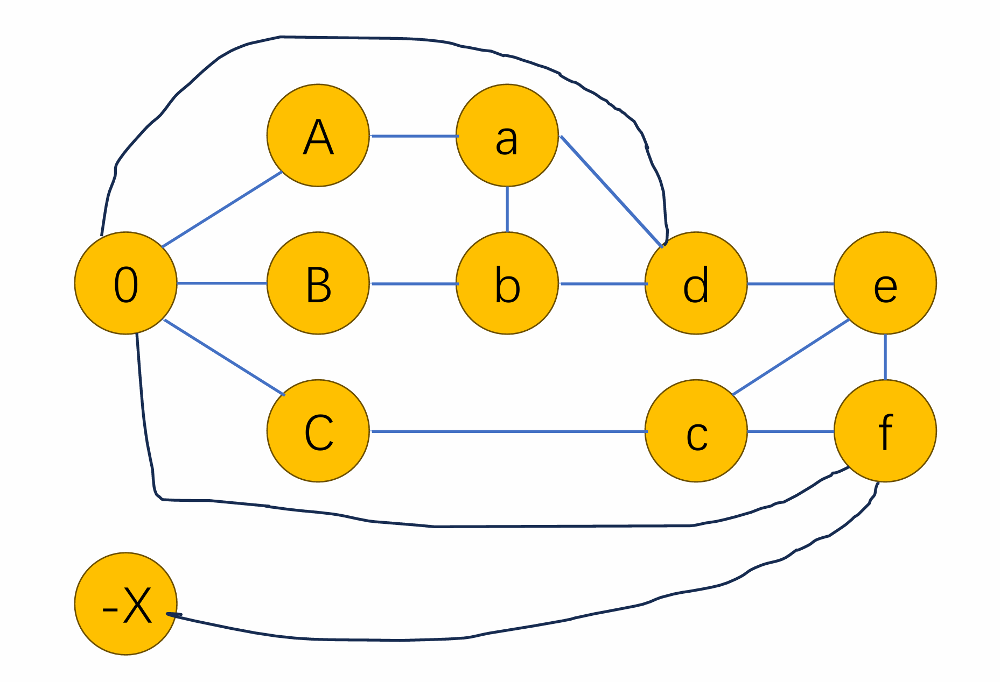

# HW6

$$
\newcommand \NP{\text{NP}}
\newcommand \P{\text{P}}
\newcommand \A{\mathcal{A}}
\newcommand \O{\mathcal{O}}
\newcommand \hard{\text{NP-hard}}
\newcommand \complete{\text{NP-complete}}
\newcommand \clique{\text{clique}}
\newcommand \ham{\text{Hamilton Path}}
\newcommand \span{\text{spanning tree}}
\newcommand \S{\mathcal{3}\text{-SAT}}
\newcommand \C{\mathcal{3}\text{-color}}
$$

## T1

First of all, we need to prove that such a problem is in $\NP$. We may come up with an verifier $\A(x, y)$ where $x$ is the input encoded, $y$ is a solution clique with size exactly $n/2$ of the problem. This verifier can easily implemented by checking all the edges within the graph, the time complexity of which is at most $\O(V^2) = \O(n^2)$, which is polynomial. It's trivial to see that if and only if the primal problem $x$ has a solution, there exists a $y$ that $\A(x,y)$ accept. So, we may claim that such a problem is in $\NP$.

Next, we just need to prove that such a problem is $\hard$. Since we have already known that $\clique$ is an $\hard$ problem, we just need to demonstrate the reduction from $\clique$ to this problem.

For a $\clique$ problem, suppose its input as $G=(V,E),|V| = n, k \in [1,n]$. Then we may discuss and construct:

### 0x0: $k = n/2$

This is exactly the case of our $n/2 ~\clique$ problem.

### 0x1: $k \gt n / 2$

We add $2k - n$ dummy vertices to $G$ , which have no edge with any other vertices in the graph, denoted as $G'= (V', E), V' = V + \delta V, |V'| = 2k$. Then we treat $G'$ as an instance of $n/2 \clique$ ,and we may apply the $n/2  ~\clique$ solver to $G'$.

If the original problem has some solution $F$ ($k$ sized clique, output "yes"), then $F$ is exactly an $2k/2$ solution. So, our solver will output "yes".

If the original problem does not have any solution $F$ (output "no") but our solver still outputs "yes", then consider there exists a solution $F'$ in our $G'$, which must be a $2k/2= k$ sized clique. Since we don't have any edges connected to those newly added dummy vertices, they will not appear in the solution $F'$.  That means, $F'$ is still valid on the original graph $G$ (since it contains no newly-added vertices). Sadly, that contradicts the assumption that original problem do not have any solution and output "no". So, we may draw the conclusion that out solver will outputs "yes".

To sum up, we can translate an instance of $\clique$ problem $G$ to our $n/2 ~\clique$ problem $G'$, and $G$ has a solution if and only if $G'$ has a solution.

### 0x3: $k \lt n / 2$

The case is similar to the case above. We just need to add $n - 2k$ active vertices to the original graph, which connect with all other vertices in the graph. That constructs a new graph $G'=(V',E')$ where $V' = V + \delta V$ and $E' = E + \{ (u,v) ~ | ~ u ~\in \delta V, u \ne v \}$ .

Similar to the proof above, we may prove that the original problem $G$ has a solution if and only if the newly constructed $G'$ has a $(n + n - 2k) / 2 = n - k$ solution.

### 0x4: summary

To sum up, for any $G,k - \clique$  problem, we may find some way to translate it into some $G',|G'|/2 - \clique$ problem in polynomial time (just adding no more than $|V|^2|$ edges and $|V|$ vertices). And the $\clique$ problem has a solution if and only if our problem has a solution. So, we may reduce $k-\clique$ to our $n/2- \clique$ problem. Since $k-\clique$ is $\hard$, we may draw that our problem is $\hard$.

In the end, since the problem is both within $\NP$ and $\hard$, this is an $\complete$ problem.

## T2

### a

First of all, we need to prove that the problem is in $\NP$. However, I think I prove too long in T1, which really exhausted me. So I just write briefly here. For a solution $\span$, we can verify it in polynomial time by checking all the vertices within the $\span$, counting the degree and judging whether it exceed the limit $k$. This can be done within $\O(|V| \times |E|)$ time, which is polynomial.

Then we need to prove that the problem is $\complete$. We may reduce $\ham$ to our problem. For any $\ham$ problem $G=(V,E)$. Then, trivially, we may observe that any valid $\ham$ is a $\span$ with degree no more than $2$.

In reverse, for any $\span$ with degree no more than $2$. Consider an arbitrary path from one leaf of the $\span$ to another. If it does not cover all vertices, since it's a $\span$, those unvisited parts must connect to those travelled vertices. However, for any vertices on the path, we may easily verify that it can not reach out (have edges with those unvisited parts), since the degree of those on-the-path vertices is at most $2$, but connection with the adjacent vertices on the path have already contributed to both of the $2$. So sadly, the unvisited part can not connect with this path, which contradicts the definition of $\span$. That means the path covers all the vertices in the tree, which consist of a $\ham$.

So, we may claim that existing a $\ham$ equals to existing a $\span$. So, trivially, we may reduce $\ham$ to our problem with setting $G, k = 2$, which means our problem is $\hard$.

To sum up, our problem is $\NP + \hard = \complete$.

### b

In part a, we have proved $\ham$ equals to $\max 2~ \span$ problem, which is $\complete$. Luckily, the verifier still works for this problem. So we just need to prove that this problem is $\hard$. By my intuition, I choose to reduce the $\max 2 ~\span$ problem to this $\max k ~\span, k \gt 2$ problem.

For any instance $G=(V,E)$ of $\max 2$, we may assign each vertex with an extra of $k - 2$ vertices, and those vertices only have edge with the corresponding vertex. (For example, for vertex $u$, we allocate $x_{u,1},\cdots,x_{u,k - 2}$ , and for each $x_{u,i}$, the only edge connected to it is $u$.) Then we got $G' = (V', E')$, where $|V'| \le k |V|, |E'| \le |E| + k|V|$, still polynomial! We treat $G'$ as an instance of $\max k$.

If $\max 2$ outputs "yes", having a solution $F$. Then in $G'$, we may construct solution $F'$, which simply adding edges connecting each vertex to those $k-2$ vertices assigned to it. It's easy to check that $F'$ has maximum degree no more than $2 + k - 2 = k$, which is a valid solution of $\max k$.

If $\max 2$ outputs "no", then consider any solution $F'$ in $G'$. Since the only edge connecting to each of those newly assigned vertices consist of the the newly added edges, we must choose them all to be a valid $\span$. Then if our $\max k$ outputs "yes", we may first remove all the newly added edges from $F'$. After that, all the edges remained are within $E$, and we need to at least connect all the vertices within $V$ (since there's no edges between newly added vertices). However, since $\max 2$ outputs "no", the maximum degree of the rest part is at least $3$. Suppose the vertex $x$ in $V$ has degree no less than $3$, then in $F'$, since it should connect to the assigned $k - 2$ vertices, its degree is at least $k - 2 + 3 = k + 1$, which exceed $k$, contradicting the $\max k$.

Based on all these facts, we may reduce $\max 2$ to $\max k$, and since $\max 2$ is $\hard$, we may draw conclusion that $\max k$ is $\hard$ too. Along with the same verifier showing that $\max k$ is $\NP$, the problem is $\complete$.

## T3

The verifier just need to check a color scheme in all edges, which have a time complexity no more than $\O(|E| + |V|)$, which is polynomial. So, we can claim that this problem is in $\NP$.

Then we just need to show that this problem is $\hard$. We here prove it by reduction from $\S$ to $\C$. Given an input of $\S$ with clause $l_1, l_2, \cdots, l_n$ and variable $x_1, \cdots, x_m$ ($m \le 3n$) appeared. We may construct a following graph:

- Construct a triangle made up of vertices: $0,X,-X$
- For each variable $x_i$, construct $2$ vertices $y_i, y_{-i}$ in the new graph, and construct triangles made up of $0, y_i, y_{-i}$. If $x_i$ appears as $\neg x_i$ in some clause, we call its representation $y_{-i}$, otherwise $y_i$.
- For each clause $l_z$ , suppose the representation of the variables appeared are $y_i, y_j, y_k$ (note that $i,j,k$ is allowed to be negative). For simplicity, we denote them as $A,B,C$. Then, we construct a subgraph as below:

All the edges are added additionally. Then we claim that $\S$ has a solution if and only if there must exist a valid $\C$​ on current graph.

### left to right

If $\S$ has a solution, consider each $x_i$. If true, we assign $y_i$ with red and $y_{-i}$ with blue. We assign $0$ with color green. In fact, for each vertex, the color is red where represented as true, blue where represented as false. For a red vertex, we call it true. For a blue vertex, we call it false. For a green vertex, we call it kupi. There is a trivial observation here that each adjacent-to-$0$ vertex is either true or false (e.g. $A,B,C,d,f$ in the graph). We also assign $X$ as true and $-X$ as false.

For those vertices generated by a clause, just a shown in the graph, $A,B,C$ is representation of $x_i,x_j,x_k$ in the clause. We first investigate the minimum "logical or unit" composed of $A,B,a,b,d$. Then, we can always find a possible coloring where $d$ is $A \vee B$. If $A,B$ both true (or false), we may simply let $a$ be kupi, and let $b$ be false(or true), and $d$ be true(or false), which is exactly $A \vee B$. If $A,B$ is one true + one false (without a loss of generality, we suppose $A$ is true, $B$ is false), then just let $a$ be false, $b$ be kupi, and $d$ be true (which is again $A \vee B$). The same is the case with $d,c,e,C,f$. So we may color $f$ as $(A \vee B) \vee C = A \vee B \vee C$.

Still, we need to check that where $f$ will not conflict with its neighbor $0$ and $-X$. Guaranteed by $\S$, we have that $A \vee B \vee C$ = true. Luckily (and magically), $0$ is kupi, and $-X$ is false. So, there's no confliction for any clause in the plan above, which means there's a valid $\C$.

### right to left

First of all, trivially $X$, $0$, $-X$ have pairwise distinct color. We may redefine the color as $X, 0, -X$.

If $\C$ has a solution, we may easily check that if $A,B,C$ are all colored as $-X$, then $d$ can only be colored as $-X$, and so is $f$, which brings a conflicting edge $f$ and $-X$. So, at least one in $A,B,C$ should be colored as $X$ (since connected to $0$, they can't be colored as $0$). Then, for each clause and representation $A,B,C$, suppose $A = x_i$ and $A$ colored $X$, then $x_i$ = true. If $A = x_i$ and $A$ colored $-X$, then $x_i$ = false. If $A = \neg x_i$ and $A$ colored $X$, then $x_i$ = false. If $A = \neg x_i$ and $A$ colored $-X$, then $x_i$ = true. Using simple checking, we may find that we get a non-conflict plan, which means that $\S$​ has solution.

### final summary

$\complete = \NP + \hard$

## T4

- T1: 0.5h, easy.
- T2: 1h, a bit tricky.
- T3: 3h, lunatically hard. Should not be rated.
