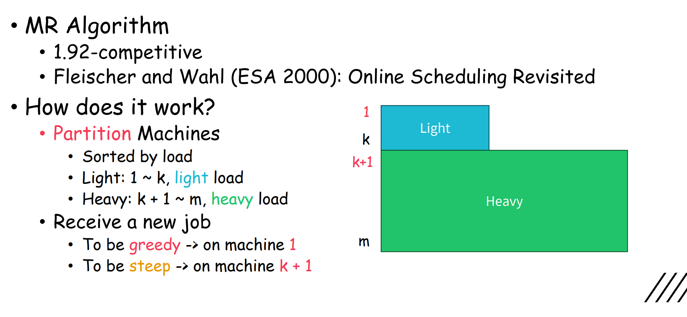
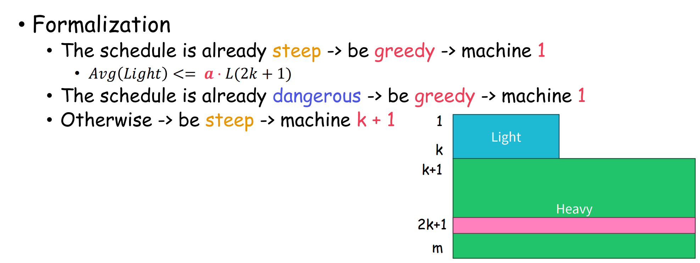

# Week 4

## Online Scheduling

Makespan Minimization (Load Balancing)

Input: $m$ identical machines. $n$ jobs with processing times $p1, p2, ..., pn$.

Output: The minimized **max** completion time. (Makespan)

Greedy:

- Receive jobs in some order
- Schedule each job on the earliest available machine
- $(2 - 1/m)$-competitive

Offline:

- Improve greedy by LPT
- $4/3$-competitive

### Greedy

1. $\text{ALG} = t + p_n$
2. $\text{ALG} - \text{OPT} \le \frac{m-1}{m}p_n$
3. $\text{OPT} \ge p_n$
4. $\text{ALG} \le \frac{2m}{m-1}\text{OPT}$

Explanation:

- $p_n$ is the last job to be scheduled.
- suppose $p_n$ is scheduled on machine $i$ (earliest available machine), then the available time is $t$.
- (1) is the algorithm's completion time.
- (2) since we schedule $p_n$ on the earliest available machine, the overall workload is at least $t \times m + p_n$. So $\text{OPT} \le t  + \frac{p_n}{m}$. Then we have (2)
- (3) is trivial. The last job must be scheduled (which takes time $p_n$)
- (4) is derived from (2) and (3)

### Improvement

> TL;DR: Core idea: avoid to be flat.

Partition machine into light & heavy load. Load to light machine only if the schedule is already steep or potential heavy machine is already full.

Notations:

- $L(i)$: Load of the $i$-th machine.
