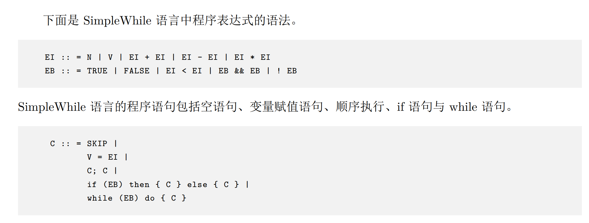
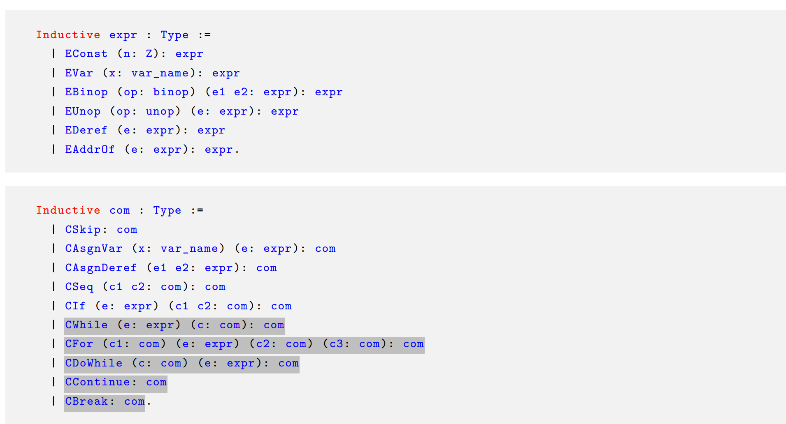

# coq?

## 指令

- `unfold`: 展开一个定义
- F(X,Y) 写作 F X Y, 等价于 (F X) Y
- 证明关键词: Fact; Proposition; Example; Lemma Theorem; Corollary.
- 数学库: nia. (non-linear integer arithmetic). lia. (linear integer arithmetic).
- `intros`: 移动结论中的前提假设到前提中. intros x 限定只引入一个变量而不是全部.
- `pose proof`: 引入一个引理, 可以在证明中使用.
- `apply`: 用一个引理证明结论. (直接证明结论)
- `fun`: 匿名函数. (fun x => x + 1) 表示一个函数, 接受一个参数 x, 返回 x + 1.
- `rewrite`: 前提中有形如 a = b 的项, 把结论中的 a 替换为 b. 用 <- 可以反向替换.
- `Fixpoint`: 定义递归函数.
- `Inductive`: 定义归纳类型.
- `induction x`: 对 x 进行结构归纳证明. 归纳要求类型满足: 有限递归(可`destruct`), 分类互斥(`discriminate`), 单射(`injection`).
- `match`: 模式匹配. 可以作用于归纳类型.
- `left, right`: 如果结论形如 $A \lor B$, 可以用 left 证明 $A$, 用 right 证明 $B$.
- `split`: 如果结论形如 $A \land B$, 可以用 split 分别证明 $A$ 和 $B$.
- `destruct`: 前提中有形如 $A \lor B$ 的项, 可以用 destruct , 需要额外分别证明 $A$ 和 $B$. 如果是 $A \land B$, 可以用 destruct 直接获得 $A$ 和 $B$.
- `specialize`: 特化一个引理, 用一个变量替换引理中的变量.
- `assert`: 断言, 用于引入一个新的引理. (新引入的也需要证明)
- `exists`: 存在量词. 指明存在的值是什么.

## 简单语言

## 指称语义 Denotational Semantics

$[e]s$ 表示表达式 $e$ 在 $s$ 状态下的值.

基于关系的指称语义.

$(s_1,s_2) \in [c]$ 当且仅当 $c$ 在 $s_1$ 状态下执行后得到 $s_2$ 状态.

二元关系复合: $R_1 \circ R_2 = \{(s_1,s_2) | \exists s. (s_1,s) \in R_1 \land (s,s_2) \in R_2\}$

## 不动点定理

- $f(x) = x$ 的解称为不动点.

Kleene 不动点定理: 偏序集的一条链的不动点就是 lub(least upper bound).
