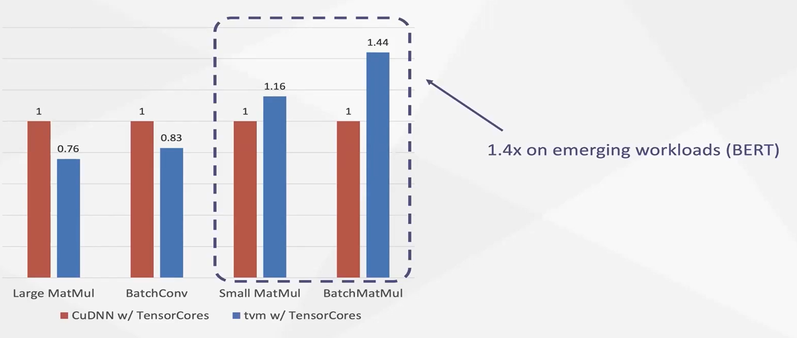
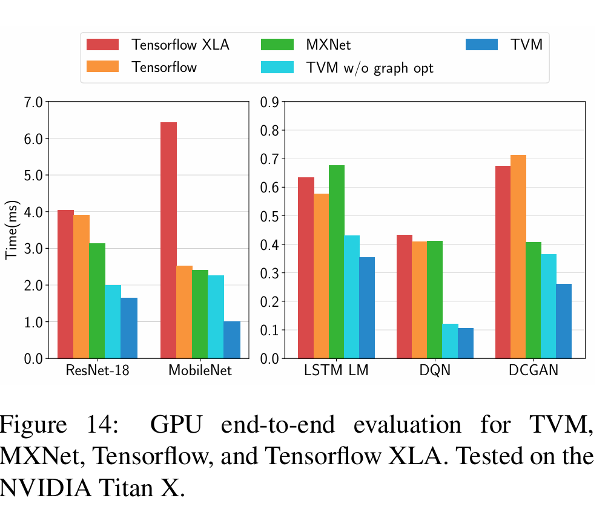
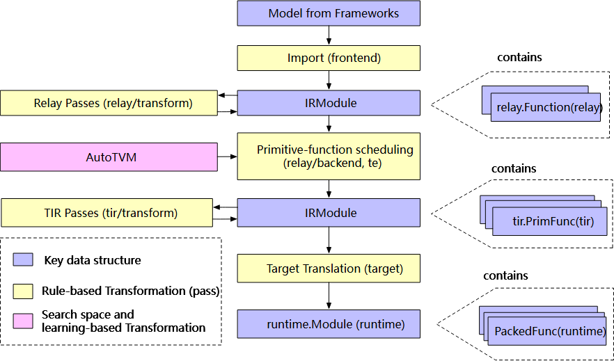
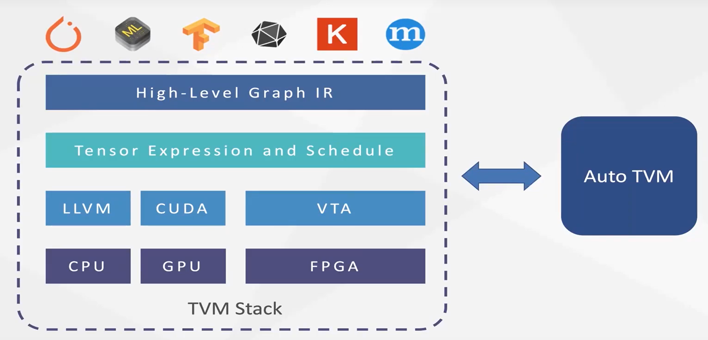

# TVM

TVM 解决的问题，是希望把把度学习模型 Model deploy 到各种各样的平台。

## 背景

深度学习的模型非常 nb, 我们需要大量的高效的 deep learning 程序，这就需要一个高效的 deep learning 编译器，帮我们把程序真正的、高效的跑在各种硬件上，比如 CPU、GPU、TPU 、FPGA 等等。

目前, 我们有很多的深度学习框架,比如 TensorFlow, PyTorch, MXNet 等等。这些框架提供了很多的高级的 API，让我们可以很方便的定义我们的模型。但是,这些框架并没有提供很好的支持，让我们可以把我们的模型部署到各种硬件上, 往往只支持特定的硬件.

概念:

- 计算图 Computation Graph
- Kernel
- 算子融合 Operator fusion
- Shared/Global Memory

## 摘要

> We built TVM, a compiler that takes a high-level specification of a deep learning program from existing frameworks and generates low-level optimized code for a diverse set of hardware back-ends.

介绍的 challenge:

1. 利用特定的硬件 feature 和 抽象
   - 给定 input operator 描述去优化，优化有很多种的选择
   - 一些加速器需要精细控制，甚至需要利用流水线机制去隐藏内存访问的延迟
2. 优化的搜索空间巨大
   - 挑战在于不能手调 (tuning) operator, 而可调的配置很多 (循环倾斜、缓存、展开等等)
   - cost model 难以精确地建立，硬件只会越来越复杂。

## 传统方案

对于传统机器学习框架，我们会把机器学习的任务表示为高阶的数据流图。而数据流图中的一个节点则表示的是一个计算单元 (比如高维卷积, 矩阵乘法).

数据流图作为 IR (intermediate representation) 来实施优化。劣势在于太 high-level 了，无法做出一些硬件相关的优化。

而大部分框架只会 focus on 非常少的一部分 GPU 设备，并且用 highly engineered 并且 vendor-specific 的算子库 (CuDNN)。这些 operator library 需要人工 tuning 过于专用化，不具有可迁移性。

一些 balance:

- 一些图上优化产生的算子，可能不在当前的算子库里面。
- 使用了一些算子，但是这些算子是还没被优化过的。

解决的方法:

- 新的张量表达式的语言
- 自动程序优化的框架, 使用基于 ML 的 cost model 去 guide 优化器。
- 最 top-level 处, 引入了一个 graph rewriter 去充分利用 算子 level 的优化

## 优化计算图

- 算子融合——这样就不用把中间结果存到 memory 里面了
- 常量折叠、Dead Store Elimination 数据 layout 转换 (比如行/列哪个优先, 即column/row major)

## 生成张量操作

> decoupling descriptions from computation rules (or schedule optimizations)

- 一个 index formula expression language. 通过增量的应用基本的变换 (schedule primitives) 来保持程序的逻辑等价性.
- 嵌套并行 + Cooperation. Parallelism = 分割计算. Share-nothing = 工作线程不会看到它的兄弟. Cooperation = 线程组合作地获取他们需要的数据并且放到共享内存 (快, 小, 类似 cache) 空间.
- 张量化 (类似于 SIMD 架构的向量化) (行为 behavior 和生成 hardware intrinsics 分离, 为的是更好的可拓展性)
- 显式内存延迟隐藏. 重叠内存操作和计算, 以最大化内存和计算资源的利用率. (主要是 TPU 这种加速器, 一般把细粒度的同步交给 software 去做).

<!-- 优化: 向量化, 循环重组, 内存结构优化, Cache 写回, 并行化等等. -->

## 自动优化

在已经有很多的调度原语之后, 需要找到一个好的优化方案 (operator implementation), 针对 DL model 的每一层.

- 调度空间指定
- ML-based cost model. Schedule explorer proposes configurations. For each configuration, a ML model predicts the execution time on given hardware. Model 会用一些 runtime 时候测量的数据来帮助预测, 甚至可能不需要用户主动提供硬件相关的信息.

选择 Schedule Explorer 基于的 ML model 时候的考虑: quality, speed.

## 性能

- 多后端的的适配: 在新出现的算子上, 甚至能够超过已经存在的算子库的性能. 
- 
- 
- 

## 和 LLVM 的区别

- LLVM 是一个通用的编译器框架, TVM 是一个专门为深度学习优化的编译器框架.
- 其 IR 比 LLVM IR 更加上层一点, 主要注重的是调度和图上的优化. 而 LLVM 则是注重于单个函数的优化.
- LLVM 是一些确定性的优化, 而 TVM 在部署到具体的硬件上的时候, 会有一些不确定性的优化, 比如说调度的选择, 使用的是 ML 的一些自动化优化.

设计原因, 为了更好的端到端, 以及部署设备的异构性, 使得 TVM 的 IR 更加上层, 不能过于底层. 然后基于机器学习的特性, IR 主要是由一些张量表达式来表示. 至于面向硬件的优化, 则可以依赖 ML-based 的一些 runtime 方法来弥补.

## 一些额外的杂七杂八的

TVM 的前身

- halide: 多面体自动调度
- Tensor comprehension: 停更了
- 其他: 只支持特定的前/后端

TVM: 真正的端到端, 支持常见的 ML Framework, 后端也支持了很多的硬件, 优化做的也很好.

贡献:

- 找出 major optimization challenges
- 引入了全新的 schedule primitives (调度原语?), 可以带来好处(cross-thread memory reuse, novel hardware intrinsics, and latency hiding)
- 提出并且实现了 TVM 这个基于 ML 的优化系统
- 端到端, 允许从那些 high-level 的框架(比如 TensorFlow, MXNet, PyTorch) 到各种后端

工作流程:

- 输入人工智能模型
- 把模型接入 TVM, 模型网络结构用 Relay IR 表示, Relay IR 每个节点通过 TE 定义计算
- 通过 AutoTVM 或 Ansor 对 TE 定义的算子或计算子图进行调度.
- 为模型选择最优调度
- 降级成为 Tensor IR
- 生成可执行的代码.

## 其他文稿?

TVM 解决的问题，是希望把把深度学习模型 Model deploy 到各种各样的平台。

首先讨论一下传统的机器学习系统。

对于传统机器学习框架，我们会把机器学习的任务表示为高价的数据流图。而数据流图中的一个节点则表示的是一个计算单元 (比如高维卷积, 矩阵乘法)

为了把高维数据流映射到底层的硬件，一般依赖一些底层的库，比如 cuDNN 什么的。已经有的算子库的限制在于，对于每个高级节点，必须要找到一个底层对应的算子。这就需要工程师(人力)来设计对应的算子。

我们可能会把一些邻居节点融合，1.5x speedup.

自动化的办法 (基于机器学习的程序优化器)。

高层节点表示: 张量语法表达式。定义了搜索空间，来搜索底层的程序。
