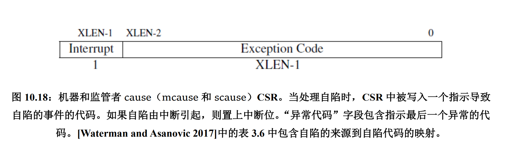

<!-- RISC-V-Reader-Chinese-v2p1 -->
# Chapter 10

## 10.3 Machine mode exception

8 CSR is used to handle machine mode exception. Summary:

- mtvec: Place to jump when exception occurs.
- mepc: Place to store the address of the instruction that caused the exception.
- mcause: The cause of the exception.
- mie: Whether each interrupt is enabled.
- mip: Whether each interrupt is pending.
- mtval: Extra information about the exception. (e.g. the address that caused the exception)
- mscratch: A place to store a value that comes in handy at the very start of an exception handler. (Temporary buffer)
- mstatus: Global interrupt enable bits.

> Remarks: E = Enable/Exception. I = Interrupt. M = Machine. S = Supervisor. U = User.

### mtvec

Must be aligned to 4 bytes. The lowest 2 bits are always 0. The lowest 2 bits are used to determine the mode of the trap vector.

- Mode 0: Direct mode. Address in BASE.
- Mode 1: Vectored mode. Address in BASE + 4 * cause.
- Mode other: Reserved.

### mepc

Place to store the address of the instruction that caused the exception.

When calling `mret`, it copies the value of mepc to pc.

### mcause

### mip

Indicates whether each interrupt is pending.

- xTIP: Whether the x mode timer interrupt is pending.
- xSIP: Whether the x mode software interrupt is pending.
- xEIP: Whether the x mode external interrupt is pending.

Only low level bits can be written using `csr(r)w` commands. If those bits are written 1, the corresponding interrupt will be delivered to lower privilege level.

e.g. MTIP is read-only, and cleared when writing to time comparator register. The UTIP and STIP bits may be written to 1 to deliver the timer interrupt to lower privilege level.

### mstatus

- xIE: Whether the x mode interrupt is enabled globally.
- xPIE: When exception occurs, it save the old value of xIE. When calling `mret`, it restores the old value of xIE.
- xPP: The privilege level of the previous mode. When calling `mret`, it restores the old privilege level.

## 10.5 Supervisor mode exception

### mideleg && medeleg

Delegate the interrupt/exception (I/E) to the supervisor mode.

In default, all the interrupts/exceptions are handled by the machine mode. By configuring mideleg and medeleg, we can delegate the interrupts/exceptions to the supervisor mode.

x'th bit of mideleg means whether the x'th interrupt can be delegated to the supervisor mode.

x'th bit of medeleg means whether the x'th exception can be delegated to the supervisor mode.

### other CSRs

stvec, sepc, scause, stval, sscratch, sstatus, sie, sip.......

Share the same meaning as the machine mode exception.

Only works in when the interrupt/exception is passed to the supervisor mode to handle.

