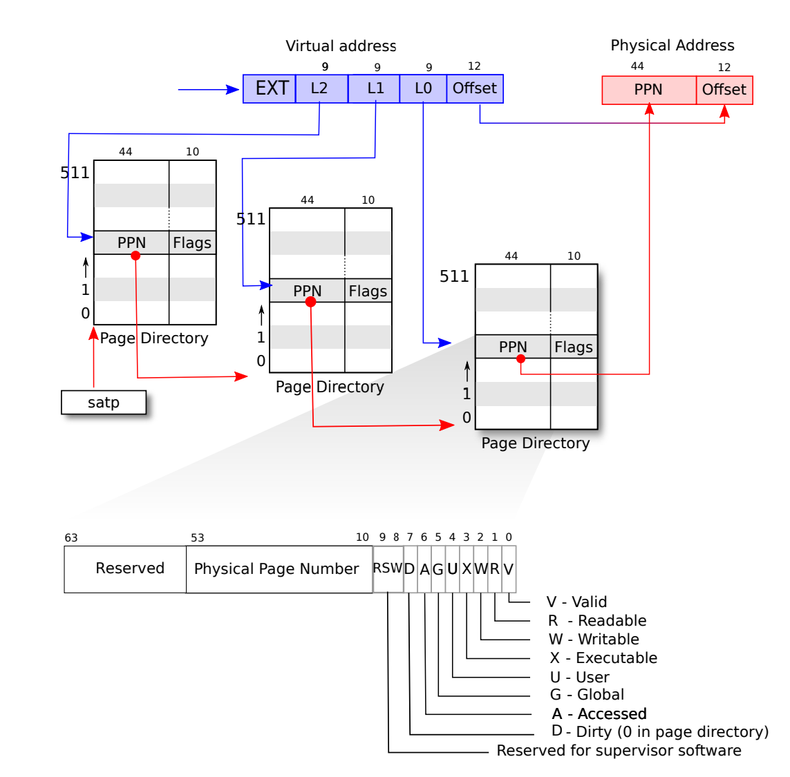
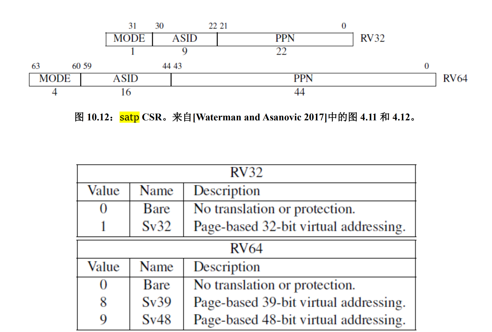
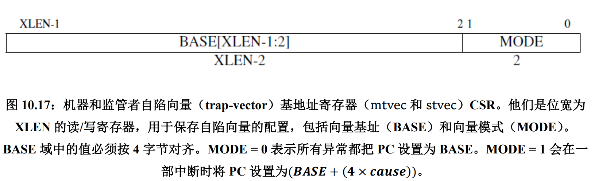
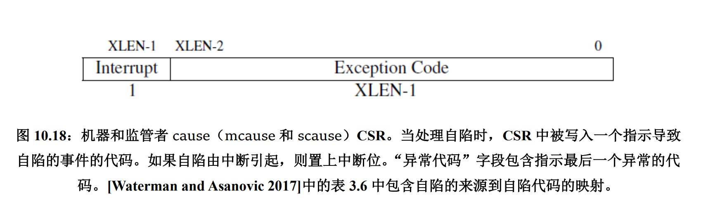
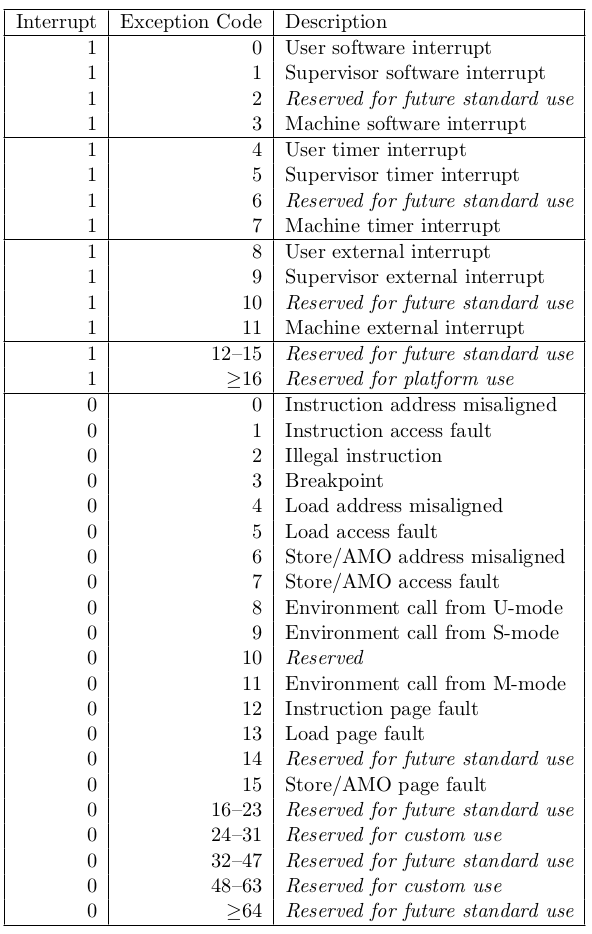

# Chapter 3

Sv39: 27 entry + 12 offset = 39 bits. Top 25 bits should not be used.

PPN: Physical Page Number. 44 bits.

PTE: Page Table Entry. PPN + flags (10 bits).

Details: 27 bits virtual address -> 9 bits VPN2, 9 bits VPN1, 9 bits VPN0. 3-level page table **tree**.

> Why 9 bits? Because PTE is stored in 8 Bytes. 9 bits means 512 entries, so the size of page table is exactly 512 * 8 Byte= 4KB. It's well-designed.

satp: Supervisor Address Translation and Protection. PPN in satp register is the physical base address of page table.

# Chapter 4

- stvec: The kernel writes the address of its trap handler here; the RISC-V jumps to the address in stvec to handle a trap.
- sepc: When a trap occurs, RISC-V saves the program counter here (since the pc is then overwritten with the value in stvec). The sret (return from trap) instruction copies sepc to the pc. The kernel can write sepc to control where sret goes.
- scause: RISC-V puts a number here that describes the reason for the trap.
- sscratch: The kernel places a value here that comes in handy at the very start of a trap handler. (Maybe as a temporary I guess)
- sstatus: The SIE bit in sstatus controls whether device interrupts are enabled. If the kernel clears SIE, the RISC-V will defer device interrupts until the kernel sets SIE. The SPP bit indicates whether a trap came from user mode or supervisor mode, and controls to what mode sret returns.

Some more details(RISC-V-Reader-Chinese-v2p1 Page 110):

When it needs to force a trap, the RISC-V hardware does the following for all trap types (other than timer interrupts):
1. If the trap is a device interrupt, and the sstatus SIE bit is clear, don’t do any of the following.
2. Disable interrupts by clearing SIE. 
3. Copy the pc to sepc. 
4. Save the current mode (user or supervisor) in the SPP bit in sstatus. 
5. Set scause to reflect the interrupt’s cause. 
6. Set the mode to supervisor. 
7. Copy stvec to the pc.
8. Start executing at the new pc.
